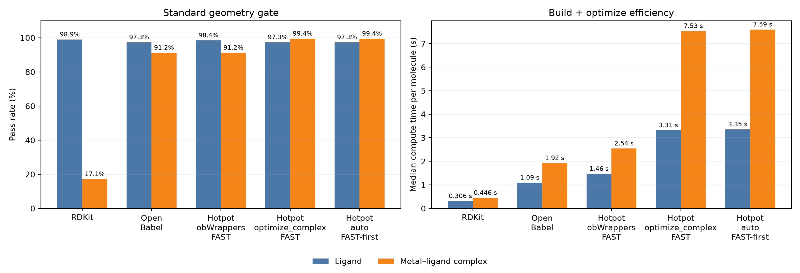

# 🥘 Hotpot (火锅)

**A Human- and LLM-Oriented Toolkit with Chemical Priors for Open-Ended Cheminformatics Tasks**

> **In Hotpot, every ingredient is cookable.** 什么都能涮
> **In data-driven chemistry, every problem is computable.** 什么都能算

Hotpot presents chemistry through two equally important conceptual entry
points: `Molecule` for molecular systems and `Crystal` for periodic systems.
`Molecule` is the mature working interface today; `Crystal` defines an equal
part of the long-term public model and remains under active development.

Hotpot is designed around four layers:

1. a frontend that chemists can read and use directly;
2. a structured CLI that language models and automation agents can call
   reliably;
3. a silent cheminformatics layer that applies domain rules without burdening
   the caller with implementation details; and
4. AI backends exposed as chemistry operations rather than training code.

The public documentation therefore focuses on observable behavior, scientific
scope, and stable interfaces. Internal chemical decision policies and model
implementation details are intentionally kept outside the user-facing API.
The preceding project description is preserved as
[README.2026.md](README.2026.md) for historical reference; this document is
the description of the current checkout.

## Contents

- [Command-line interface](#command-line-interface)
- [Installation](#installation)
- [Python interface](#python-interface)
- [Chemistry capabilities](#chemistry-capabilities)
- [Geometry and force-field validation](#geometry-and-force-field-validation)
- [Validation evidence](#validation-evidence)
- [Scientific boundaries](#scientific-boundaries)
- [References](#references)
- [Roadmap](#roadmap)
- [Development](#development)

## Command-line interface

The CLI is the preferred interface for shell workflows, language-model tool
use, and reproducible pipelines. Each command accepts `--help`; the chemistry
commands also provide extended examples through `--doc`.

| Command | Purpose | Typical output | Detailed guide |
|---|---|---|---|
| `hotpot mca` | Predict site-resolved methyl cation affinity (MCA) | Atom table in kJ/mol | [MCA CLI](hotpot/cheminfo/AImodels/mca/cli_doc.md) |
| `hotpot cbond` | Predict and construct metal–ligand coordination bonds | Complex SMILES or ranked structures | [CBond CLI](hotpot/cheminfo/AImodels/cbond/cli_doc.md) |
| `hotpot ff` | Build or optimize 3D molecular structures and report quality | Molecular structure file and optional JSON report | [Force-field CLI](hotpot/cheminfo/forcefields/cli_doc.md) |

### MCA prediction

<!-- Verified by tests/readme/test_readme_examples.py::test_readme_mca_cli_output -->

```bash
$ hotpot mca 'c1ccccc1CN' --device cpu
```

```text
No.  Atom  MCA(kJ/mol)  is_Nuc_site
1    C     319.00       False
2    C     304.00       False
3    C     329.25       False
4    C     303.50       False
5    C     318.75       False
6    C     324.00       False
7    C     314.50       False
8    N     489.50       True
```

MCA is reported for every heavy atom. `is_Nuc_site` marks the sites selected
by the supported nucleophilic-site definition.

### Coordination-bond construction

<!-- Verified by tests/readme/test_readme_examples.py::test_readme_cbond_cli_output -->

```bash
$ hotpot cbond Eu \
    'O=C(N(C)CCC)C(C=C1)=NC2=C1C=CC3=C2N=C(C4=NC(C(C)(C)CCC5(C)C)=C5N=N4)C=C3' \
    --device cpu --bond-detail
```

```text
CCCN(C1=[O][Eu@]23n4c1ccc1c4c4n3c(-[c]3n2nc2c(n3)C(C)(C)CCC2(C)C)ccc4cc1)C
Cbond Detail:
AtomIdx  Atom  Score
10       N     4.04834
17       N     7.02889
0        O     6.10205
32       N     4.98739
-- End --
```

This is the `(CyMe4)Pyz-PrMe-DIPhen` extractant used in Hotpot's coordination
chemistry examples. The result is not a decorative single-bond demonstration:
the model selects four donor atoms across a chemically complex ligand,
constructs the Eu coordination graph, and reports the score associated with
each selected metal–donor bond. The ligand may also be supplied as a molecular
file. Use `--all-structures` when ranked alternative coordination structures
are required. By default, the first coordination bond uses a raw-score
threshold of `-0.5`; subsequent bonds use `-0.125`.

### Force-field optimization

<!-- Verified by tests/readme/test_readme_examples.py::test_readme_forcefield_cli_output -->

```bash
$ hotpot ff CC --epochs 1 --steps-per-epoch 20 --quality standard \
    --seed 2026 --report ethane.json -o ethane.mol2
```

This writes a parseable, hydrogen-complete 3D structure to `ethane.mol2` and
a machine-readable validation report to `ethane.json`. A successful report
contains `"status": "ok"`.

Commands compose through standard input and output, which makes the public
surface convenient for both people and LLM-driven tools:

<!-- Verified by tests/readme/test_readme_examples.py::test_readme_cbond_forcefield_pipeline -->

```bash
$ hotpot cbond Eu \
    'O=C(N(C)CCC)C(C=C1)=NC2=C1C=CC3=C2N=C(C4=NC(C(C)(C)CCC5(C)C)=C5N=N4)C=C3' \
    --device cpu \
    | hotpot ff - --input-format smi --epochs 1 --steps-per-epoch 20 \
        --quality off --seed 2026 -o eu-extractant.mol2
```

## Installation

Hotpot supports Python 3.9–3.14 for its chemical kernel, search layer, and
ONNX inference path. Python 3.10 or newer is recommended.

### Install from PyPI

```bash
$ conda create -n hp python=3.11 pip -y
$ conda activate hp
$ python -m pip install --upgrade pip
$ python -m pip install hotpot-zzy
```

### Install the current source

```bash
$ git clone https://github.com/Zhang-Zhiyuan-zzy/hotpot.git
$ cd hotpot
$ conda create -n hp python=3.11 pip -y
$ conda activate hp
$ python -m pip install --upgrade pip
$ python -m pip install -e .
```

The source tree can contain interfaces newer than the latest PyPI release.

### Optional dependency profiles

| Extra | Installation | Scope |
|---|---|---|
| `pymol` | `python -m pip install 'hotpot-zzy[pymol]'` | NumPy profile compatible with PyMOL 3.1; PyMOL itself is not installed |
| `optimize` | `python -m pip install 'hotpot-zzy[optimize]'` | Classical optimization and machine-learning workflows |
| `datasets` | `python -m pip install 'hotpot-zzy[datasets]'` | Dataset download, HDF5, and PyG support |
| `complexformer` | `python -m pip install 'hotpot-zzy[complexformer]'` | ComplexFormer training and LoRA dependencies |
| `onnx-export` | `python -m pip install 'hotpot-zzy[onnx-export]'` | ONNX export and inspection tools |
| `dev` | `python -m pip install -e '.[dev]'` | Tests, linting, coverage, and package builds |

PyMOL 3.1 requires `numpy>=1.26.4,<2`. Use the `pymol` profile in an isolated
environment if PyMOL is required.

ONNX inference uses CPU by default and automatically selects an available GPU
provider. GPU users must install an `onnxruntime-gpu` build compatible with
the machine's CUDA and cuDNN libraries; the newest runtime is not necessarily
compatible with every installed CUDA version.

## Python interface

The Python API expresses the same operations through native chemical objects.

### Site-resolved MCA

<!-- Verified by tests/readme/test_readme_examples.py::test_readme_mca_python_api_output -->

```python
from hotpot import read_mol
from hotpot.calculator import mca

mol = read_mol("c1ccccc1CN")
mca(mol, device="cpu")
for atom, value in mol.mca_sites.items():
    print(atom.label, f"{value:.2f}")
```

```text
N7 489.50
```

`atom.mca` is a read-only result. Accessing it before prediction raises an
error that directs the caller to the calculator.

### Molecular objects, rings, and aromaticity

<!-- Verified by tests/readme/test_readme_examples.py::test_readme_core_ring_and_aromaticity_output -->

```python
import hotpot as hp

mol = hp.read_mol("c1ccccc1O")
print(len(mol.atoms))
print([len(ring.atoms) for ring in mol.rings])
print([ring.is_aromatic for ring in mol.rings])
```

```text
7
[6]
[True]
```

Hotpot exposes molecular rings and performs aromaticity perception. More
detail about graph-level ring APIs is available in the
[graph package guide](hotpot/cheminfo/graph/README.md).

### Interoperability

<!-- Verified by tests/readme/test_readme_examples.py::test_readme_conversion_output -->

```python
import hotpot as hp

mol = hp.read_mol("CCN")
print(len(hp.to_hotpot_mol(mol.to_rdmol()).atoms))
print(len(hp.to_hotpot_mol(mol.to_obmol()).atoms))
```

```text
3
3
```

`to_hotpot_mol` is the shared conversion entry point for Hotpot, RDKit, and
Open Babel molecular objects.

### Thermodynamic and graph representations

<!-- Verified by tests/readme/test_readme_examples.py::test_readme_thermo_output -->

```python
import hotpot as hp

mol = hp.read_mol("c1ccc(O)cc1", "smi")
thermo = mol.get_thermo(temp=298.15, pressure=101325)
print(thermo.Tc)
print(thermo.Psat)
```

```text
694.2
80.20201686
```

<!-- Verified by tests/readme/test_readme_examples.py::test_readme_graph_spectrum_output -->

```python
import hotpot as hp

phenol = hp.read_mol("c1ccc(O)cc1", "smi").graph_spectral()
benzoic_acid = hp.read_mol("c1ccccc1C(=O)O", "smi").graph_spectral()
reordered_phenol = hp.read_mol("c1ccccc1O", "smi").graph_spectral()

print(phenol.vectors.shape)
print(benzoic_acid.vectors.shape)
print(phenol | benzoic_acid)
print(phenol | reordered_phenol)
```

```text
(6, 13)
(6, 15)
0.907590226292854
1.0
```

## Chemistry capabilities

### Native chemical objects

- `Molecule`, `Atom`, `Bond`, and `Ring` represent molecular structure and
  expose chemistry-oriented operations.
- `Crystal` is the co-equal periodic-system concept in Hotpot's public model;
  its mature workflow remains on the roadmap.
- Common molecular formats can be read and written through a single object
  model.

### Search and SMARTS

Hotpot provides a NetworkX-based SMARTS and substructure search system while
preserving metal-aware matching. See the
[SMARTS guide](hotpot/cheminfo/smarts.md) for its public syntax and examples.

### Molecular assembly

The assembly API supports fragment joining and ring-based construction.
`RingWedge` is part of the public interface for explicitly describing a ring
wedge used in assembly. See the
[assembly guide](hotpot/cheminfo/mol_assemble/README.md).

### AI-backed chemistry

The currently packaged inference capabilities include site-resolved MCA and
metal–ligand coordination-bond prediction. Models are distributed for
inference through stable chemistry-facing interfaces; users do not need the
training implementation to call them.

## Geometry and force-field validation

Geometry provides mathematical measurements and spatial relationships;
force-field code decides how those facts affect a chemical workflow. Public
geometry concepts and relation functions are documented in the
[geometry package guide](hotpot/cheminfo/geometry/README.md).

The public force-field validation interface can assess a structure independently
of the optimizer that produced it:

<!-- Verified by tests/readme/test_readme_examples.py::test_readme_forcefield_validation_python_output -->

```python
import hotpot as hp
from hotpot.cheminfo import forcefields as ff

mol = hp.read_mol("CC")
mol.build3d(
    forcefield="UFF",
    epochs=1,
    steps_per_epoch=20,
    quality_level="standard",
    seed=2026,
)
report = ff.evaluate_structure_acceptance(mol, level="standard")
print(report.passed)
```

```text
True
```

This common report makes native Open Babel, native RDKit, Hotpot, or external
optimization results comparable under the same public geometry-quality gate.

## Validation evidence

### Ligand and Eu–ligand benchmark

Five independently launched workflows were evaluated on the same 187 isolated
ligands and the same 181 CBond-eligible Eu–ligand complexes. The three Hotpot
workflows use the default `FAST` convergence policy. Times are median
build-plus-optimize durations among completed workflows in a 16-worker run;
CBond inference, geometry validation, serialization, and rendering are
excluded.

| Workflow | Ligand geometry pass | Ligand median time | Eu–ligand geometry pass | Eu–ligand median time |
|---|---:|---:|---:|---:|
| RDKit | 185/187 (98.9%) | 0.306 s | 31/181 (17.1%) | 0.446 s |
| Open Babel | 182/187 (97.3%) | 1.089 s | 165/181 (91.2%) | 1.921 s |
| Hotpot `obWrappers` (`FAST`) | 184/187 (98.4%) | 1.465 s | 165/181 (91.2%) | 2.542 s |
| Hotpot `optimize_complex` workflow (`FAST`) | 182/187 (97.3%) | 3.314 s | 180/181 (99.4%) | 7.529 s |
| Hotpot automatic `FAST`-first workflow | 182/187 (97.3%) | 3.354 s | 180/181 (99.4%) | 7.593 s |



The independent launch commands and evidence files are documented with the
benchmark:

- [benchmark commands](tests/benchmarks/coordination_complexes/README.md)
- [aggregate CSV](assets/readme/coordination_complex_backend_comparison.csv)
- [protocol and aggregate JSON](assets/readme/coordination_complex_backend_comparison.json)
- [per-case CSV](assets/readme/coordination_complex_backend_comparison_cases.csv)

All four convergence policies remain selectable through the Python API and
`hotpot ff --convergence-level`.

## Scientific boundaries

- MCA values are model predictions in kJ/mol and are not Mayr nucleophilicity
  parameters.
- Ranked CBond path probabilities are model-relative weights, not calibrated
  experimental probabilities.
- A force-field quality pass means that the configured structural checks
  passed; it does not prove that the global minimum, oxidation state, ligand
  field, or experimentally dominant conformer is correct.
- Macroscopic observables generally describe ensembles and environments. A
  single optimized molecular structure should not be treated as a complete
  thermodynamic or experimental model.

## References

If Hotpot contributes to published work, please cite the application paper
relevant to the workflow:

1. Z. Zhang, D. Yang, Y. Que, Y. Wu and C. Liu,
   “Coordination-informed machine learning enables virtual screening of
   phenanthroline ligands by predicting Am/Eu binding preferences,”
   *Chemical Communications*, **62** (2026), 17426–17430.
   [https://doi.org/10.1039/D6CC03919G](https://doi.org/10.1039/D6CC03919G)

## Roadmap

- Mature `Crystal` workflows for periodic structures.
- A stable `Molecule.descriptors` interface.
- Automatic fine-tuning of compatible models from private molecular datasets,
  with an explicit user-controlled workflow.
- Molecule-aware experimental optimization across mixed chemical and process
  variables.
- AI-assisted molecular generation and conditional design.
- Oxidation-state perception for coordination systems.

Roadmap entries are design intentions rather than currently supported APIs.

## Development

README examples are executable regression tests. Run them with:

```bash
$ python -m pytest -q tests/readme
```

The five independent benchmark launchers and the evidence aggregation command
are listed in the
[coordination-complex benchmark guide](tests/benchmarks/coordination_complexes/README.md).

The complete test suite and coverage shortcut is:

```bash
$ ./tests/run_coverage.sh
```

## License

Hotpot is released under the [MIT License](LICENSE).
