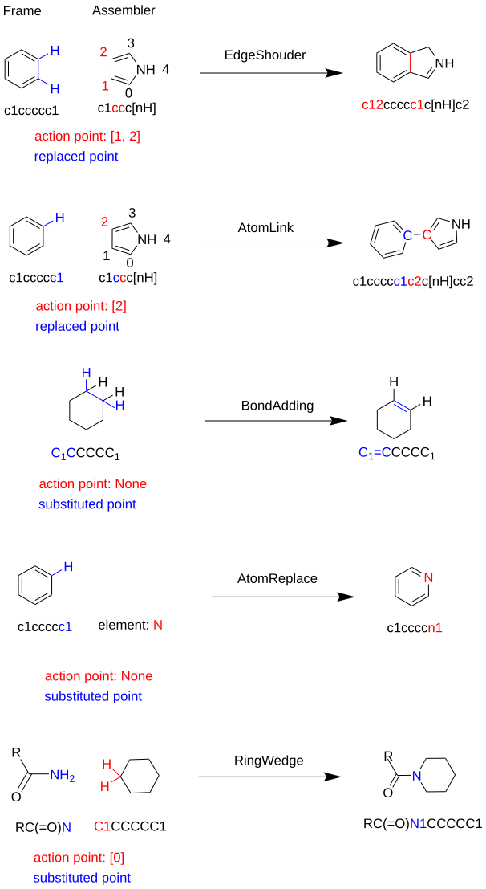
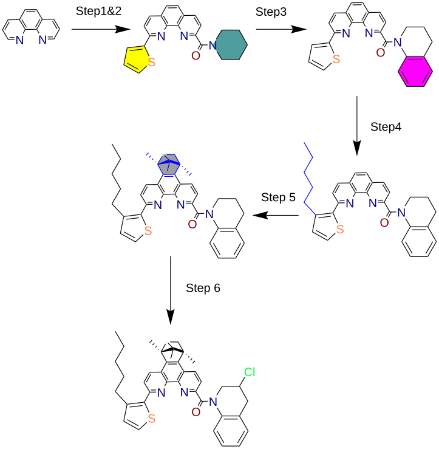

from hotpot import AssembleFactoryfrom hotpot import AssembleFactoryfrom hotpot import EdgeShoulderfrom hotpot import Fragmentfrom hotpot.cheminfo.search import Substructurefrom hotpot import Searcher

# Hotpot (`hotpot.cheminfo.mol_assemble` Module)

- [Installation](#installation)
- [Tutorial](#tutorial)
- [API reference](#hotpotcheminfomol_assemble-api)

## Installation

### Requirements

````
python >= 3.9
openbabel >= 3.1.1
cclib
lammps
````

### Install requirement
Before installing the `Hotpot`, you should install the requirements at the first. It is
recommended to create a new conda environment to run the package.
> conda create -n hp python==3.9 openbabel cclib lammps -c conda-forge

### Install
After the requirements are installed, now the ''Hotpot'' could be installed by pip
> conda activate hp
> pip install hotpot-zzy


## Tutorial

### Generic description
The molecule assemble (`hotpot.cheminfo.mol_assemble`) module iteratively generates virtual 
molecular structures based on the user-specified molecular Framework (`hotpot.Molecule`) and
assembly fragments [(`hotpot.cheminfo.mol_assemble.Fragment`)](#fragment). The Framework is a standard 
`Molecule` object, while the assembly operation is specifically implemented using the `Fragment`. 
An instantiated `Fragment` must specify the following four factors:
1) The 2D molecular structure of the fragment (a `Molecule` object)
2) The atom(s) (specified by index) on the fragment used for connection with the Framework
3) The searcher for locating connection sites on the molecule (a `hotpot.cheminfo.search.Searcher` object)
4) The specific connection operation (specified in an `action` function) between the `Fragment` and 
the Framework at the connection sites.

[`Fragment`](#fragment) provides users the flexibility to customize their own assembly strategies. 
Of course, `Hotpot` has predefined some common molecular assembly `Fragment` (named `Assembler`).
When handling the `Assembler`, users only need to specify its fragment structure and indicate the
(optional) `action_points` indices (i.e., specify which Fragmental atoms as the `"reaction site"` to
react with the frame `Molecule`).

So far, the [predefined `Assembler`](#assemblers) include (see the following `Scheme 1` for details):
1) EdgeShoulder (required two `action_points`)
2) AtomLink (required one `action_points`)
3) BondAdding (No `action_points` required)
4) AtomReplace (No `action_points` required)
5) AlkylGraft (No `action_points` required, just a specific `AtomLink`)
6) RingWedge (required one `action_points`)



***Scheme 1** Illustration of Assembly of Molecule by different Assemblers*

### Tutorial with examples
This tutorial will cover the following topics:
1) [How to use the Fragment class to customize your own Assembler](#customization-of-assembler)
2) [How to assemble new molecules using either custom or predefined Assemblers](#assemble-new-molecule)
3) [How to define Assemblers in batches and use the AssembleFactory for high-throughput assembly of new molecules](#perform-high-throughput-molecule-assembly)

#### Customization of Assembler
The example of usage of `Fragment`:
```pycon
import hotpot as hp
from hotpot.cheminfo.search import Searcher, Substructure, QueryAtom, QueryBond
from hotpot.cheminfo.mol_assemble import Fragment

# Initialize a Fragment instance
frag = Fragment(
    mol=hp.read_mol('c1ccc[nH]1', fmt='smi')  # create a pyrrole as the fragmental structure
    action_points=[0, 1]                      # specify the 1st (mol.atoms[0]) and 2nd (mol.atoms[1]) atoms as the action points (or "reaction sites")
    searcher=substructure_searcher            # a Searcher instance to locate opportune sites in the frame mol for integrating with the frag
    action_func=action_func                   # a Callable object to specify the practical implementation of assembly between frame and frag
)
```
Here, without loss of generality, I configure a *pyrrole* [`EdgeShoulder`](#generic-description) to demonstrate how to
customize an arbitrary [`Assembler`](#assemblers) (a specific `Fragment`), by giving the specification of the 
`substructer_searcher` and `action_func` in the last code.

```pycon
def has_hydrogen(atom: Atom) -> bool:
    """ The 'reaction sites' in the frame should have at least one hydrogen """
    return bool(atom.hydrogens) or atom.implicit_hydrogens > 0

# specify the substructure_searcher
substructure = Substructure()
substructure.add_atom()

atom_attrs_constraint = dict(
    # the constraint could be given by any container obj with __contains__ methods
    # or a callable object which pass an atom as its arguments and return bools.
    atomic_number={6, 7},
    has_hydrogen=has_hydrogen,
)

substructure.add_atom(QueryAtom(**atom_attrs_constraint))
substructure.add_atom(QueryAtom(**atom_attrs_constraint))
substructure.add_bond(0, 1)  # The attrs of bond can also be constrained passing kwargs.

substructure_searcher = Searcher(substructure)
```
Next, we give the definition of `action_func` in `EdgeShoulder`. When customizing your own `Assembler`,
you should:
- Keep the **signature** of your `action_func` identical to the following one!!
- returns the assembled mol.
```pycon
def shoulder_bond_action(
        mol: Molecule,
        hit: list[int],
        frag: Molecule,
        action_points: list[int]
):
    """
    Insert a fragment into the parent molecule by replacing a bond between two atoms.

    This function removes the bond between the two atoms specified by `hit` in the parent molecule,
    adds the fragment (with its atoms), and reconnects bonds to preserve molecular structure.
    Bonds and bond orders are preserved as appropriate.

    Args:
        mol (Molecule): The parent molecule (from hotpot-zzy).
        hit (list[int]): List of two indices, specifying the atoms in `mol` whose bond will be replaced.
        frag (Molecule): The fragment molecule to insert.
        action_points (list[int]): List of two indices, specifying the atoms in `frag` used to attach
            to the parent molecule.

    Returns:
        Molecule: The modified parent molecule with the fragment inserted, previously connected atoms removed.

    Raises:
        AssertionError: If `hit` or `action_points` do not contain exactly two elements.

    Details:
        - Uses hotpot-zzy `add_component`, `add_bonds`, `remove_bonds`, and `remove_atoms`.
        - Ensures correct atom re-indexing and bond order preservation during insertion.
    """
    assert len(hit) == 2
    assert len(action_points) == 2

    # update action points after add the frag as a component
    ap1, ap2 = action_points
    ap1 += len(mol.atoms)
    ap2 += len(mol.atoms)

    mol.add_component(frag)

    # Get the atoms in the replaced bond
    ma1, ma2 = mol.atoms[hit[0]], mol.atoms[hit[1]]

    # Recording the original linking net for replaced bond end (atoms)
    ma1_neigh_idx = [a.idx for a in ma1.neighbours]
    ma2_neigh_idx = [a.idx for a in ma2.neighbours]
    assert ma2.idx in ma1_neigh_idx
    assert ma1.idx in ma2_neigh_idx
    # Remove redundant link between ma1-ma2
    ma2_neigh_idx.remove(ma1.idx)
    ma1_neigh_idx.remove(ma2.idx)

    # Break all bonds with ma1 and ma2
    ma1_bonds = [mol.bond(ma1.idx, ma1n_idx) for ma1n_idx in ma1_neigh_idx]
    ma2_bonds = [mol.bond(ma2.idx, ma2n_idx) for ma2n_idx in ma2_neigh_idx]
    ma1_ma2_bond = [mol.bond(ma1.idx, ma2.idx)]

    # Recording the bond order for rebuilding below
    ma1_bond_order = [b.bond_order for b in ma1_bonds]
    ma2_bond_order = [b.bond_order for b in ma2_bonds]

    # Removing bond
    mol.remove_bonds(ma1_bonds + ma2_bonds + ma1_ma2_bond)

    # Build new link to the atoms in the fragment
    bond_ap1_info = [(ap1, ma1n_idx, ma1_bo) for ma1n_idx, ma1_bo in zip(ma1_neigh_idx, ma1_bond_order)]
    bond_ap2_info = [(ap2, ma2n_idx, ma2_bo) for ma2n_idx, ma2_bo in zip(ma2_neigh_idx, ma2_bond_order)]
    mol.add_bonds(bond_ap1_info + bond_ap2_info)

    # Remove old bond atoms
    mol.remove_atoms([ma1, ma2])

    return mol
```
In the `hotpot.cheminfo.mol_assemble` module, we integrate above code into a class named `EdgeShoulder`
while still maintaining the flexibility to define fragment structure and action points:
```pycon
class EdgeShoulder(Fragment):
    def __init__(self, mol, action_points: tuple[int, int]):
        super().__init__(
            mol=mol,
            searcher=substructure_searcher,  # As the above definition
            action_points=action_points,
            action_func=shoulder_bond_action
        )
```
For all predefined `Assembler`, see [API reference](#assemblers)

#### Assemble new molecule
Handing any custom or predefined `Assembler`, we can assemble new molecule by call the `Assembler.graph()` method:
```pycon
assembler = ...  # Custom or predefined

mol = hp.read_mol('c1ccccc1', fmt='smi')  # create benzene
new_mols = assembler.graft(mol)
print(new_mols)  # a dict of assembled molecules with SMILES as the key, for eliminating redundant ones
```

#### Perform high-throughput molecule assembly
In the practical assembly of molecules, we usually hope to acquire thousands or millions of virtual molecules
from a groups of frame molecules and a collection of `Assembler`. For generating virtual molecules in the
high-throughput (HT) method. `hotpot.cheminfo.mol_assemble` module offers an interface `AssembleFactory`, which
is designed for the HT jobs. An example of HT running with `AssembleFactory`:
```pycon
import hotpot as hp
from hotpot.cheminfo.mol_assemble import AssembleFactory

# define a group of frames
frames = [
    hp.read_mol('NC(=N)c1ccccc1'),  # Benzamidine
    hp.read_mol('c1ccc[nH]1'),      # Pyrrole
    ...                             # other frames
]

assemblers = [
    Fragment(...),                   # custom Assembler
    EdgeShoulder(...),               # EdgeShoulder Assembler
    ...                              # so on.
]

factory = AssembleFactory(
    assembler=assemblers,
    iter_step=3,                     # see `Scheme 2`
    catch_path=...,                  # where to save the final and temp results
    save_per_step=10000              # Save the result once for every `save_per_step` new molecule generated
)

results = factory.make(frames)        # run in single core
# Or, recommended for millions of molecules
results = factory.mp_make(
    frames, nproc=64)                 # run in multi processes
```
By using multi-step iteration (control in `iter_step` argument), a relatively complex virtual molecule
can be gradually generated from some more basic fragments, as illustrated in **`Scheme 2`**



***Scheme 2** Generation of complex molecule from basic building block*

Given most predefined Assembler just need *fragmental structure* and *action_points* as arguments,
You can use a Template.json file to batch define the corresponding Assemblers, following the format
in the example:
```json
[
  {
    "name": "pyrrole",  // just a comment
    "smiles": "c1ccc[nH]1",  // the molecular structure of the Assembler (or Fragment)
    "points": [[0 ,1], [1, 2], [2, 3]],  // specify all possible action points, the EdgeShoulder need exactly 2 action points
    "method": "EdgeShoulder"  // which Assembler
  },
  {
    "name": "benzene",
    "smiles": "c1ccccc1",
    "points": [[0, 1]],
    "method": "EdgeShoulder"
  },
  {
    "name": "pyrrolic",  // just a comment
    "smiles": "c1ccc[nH]1",  // the molecular structure of the Assembler (or Fragment)
    "points": [[0], [1], [2]],  // specify all possible action points, the AtomLink need exactly 1 action points
    "method": "AtomLink"  // use AtomLink assembler
  },
  {
    "name": "phenyl",
    "smiles": "c1ccccc1",
    "points": [[0]],
    "method": "AtomLink"
  },
  {
    // The `AlkylGraft` is just a particular case of `AtomLink`, given the `link_length` 
    // (say `link_length`=[3]) the AlkylGraph will graft all propyl possible graph (n-prop,
    //i-prop) on the framework molecule.
    "method": "AlkylGraft",
    "link_length": [1, 2, 3, 4, 5, 6, 7, 8] // all expected alkyl groups: methyl, ethyl, ..., actane
    // The `AlkylGraft` assembler is not required to specify the action points
  },
  {
    "name": "5cycle-RW",
    "smiles": "C1CCCC1",
    "points": [[0]],
    "method": "RingWedge"
  }
]
```
After the above Template.json file has defined, read the file and perform molecule assemble:
```pycon
assembler = AssembleFactory.load_assembler_file("Template.json")
factory = AssembleFactory(
    assembler=assembler,
    ...
)
results = factory.mp_make(frames)
```

## `hotpot.cheminfo.mol_assemble` API
### Fragment
#### Fragment
> **class** Fragment(
> mol: hp.Molecule, 
> searcher: hp.cheminfo.search.Searcher, 
> action_points: Iterable[int], 
> action_func: Callable):

Represents a molecular fragment, its potential action sites, and the logic for attaching it to a target molecule.

This class encapsulates:
- The fragment molecule.
- An action point specification (list of atom indices).
- An action function (e.g. `atom_link_atom_action` or `shoulder_bond_action`).
- A `Searcher` to locate valid grafting sites in a parent molecule.

- Args:
    + **mol** (`Molecule`): The molecular fragment.
    + **searcher** (`hp.cheminfo.search.Searcher`): An object, typically from hotpot-zzy, for identifying valid graft sites in molecules.
    + action_points (`Iterable[int]`): Indices in `mol` serving as connection points.
    + action_func (`Callable`): Function for performing the graft (must follow standard action signature).

By specifying the structure or fragment (`mol`) and `action_points` in the fragment, anchor points 
searcher (`searcher`) for framework molecule, and the assembling strategy (`action_func`). The users
could custom their own `Assembler`.

The signature of the action_func is look like:
> **def** action_func(
        mol: Molecule,
        hit: list[int],
        frag: Molecule,
        action_points: list[int]
): ...

> Methods:
- graft(frame: Molecule) -> dict['mol_smiles', Molecule]

### Assemblers
All `Assembler` have the `graft(frame)` method.
> **class** Edgeshoulder(mol: Molecule, action_points: tuple[int, int]):

> **class** AtomLink(mol: Molecule, action_points: tuple[int]):

> **class** BondAdding():

> **class** AtomReplace(ele: str):  # ele = 'H', 'O', 'Si'

> **class** RingWedge(mol: Molecule, action_points: tuple[int]):

> **class** AlkylGraft(mol: Molecule):
- The AlkylGraft is a subclass of `AtomLink` with default atom_points=[0].
- It's not recommended to directly initialize `AlkeyGraft`, instead, user can generate
a collection of `AlkeyGrapt` with certain chain length by `alkyl_generator` function:
> **function** alkyl_generator(lengths: Iterable[int]): → dict[int, list[`AlkylGraft`]]
```pycon
from hotpot.cheminfo.mol_assemble import alkyl_generator
dict_alkyl = alkyl_generator(lenghts=[3, 4])
print(dict_alkyl[3][0])  # n-prop
print(dict_alkyl[3][1])  # i-prop
print(dict_alkyl[4][0])  # n-butyl
print(dict_alkyl[4][1])  # i-butyl
print(dict_alkyl[4][2])  # t-butyl
```

### AssembleFactory

### Action Functions

