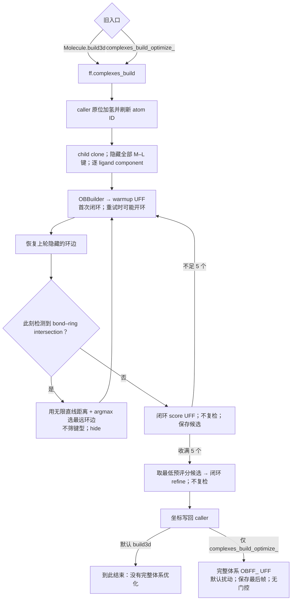
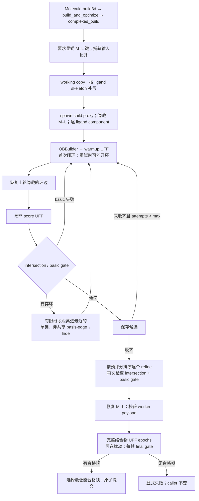

# 络合物开结流程对照审计：`0696c21` 与当前实现

> 文档状态：现状确认与比较稿
>
> 旧基线：`0696c21385d80905240c4d0d4cd5b060cfb8cebf`
>
> 当前基线：`38b911f5912ada2ce1f2edd9ec737fb9550cf5cb`（2026-09-18 工作树中的业务代码）
>
> 范围：确认新旧真实调用链、逐阶段差异、各自问题及其是否符合“生成可继续进行力场优化且不存在拓扑打结的完整金属络合物”这一目标。本文不展开下一轮整改设计。

## 1. 最关键结论

### 1.1 总判定

**当前实现明显比 `0696c21` 的旧实现更合理。** 这不是因为当前用了更高级的力场，而是因为它修正了会直接破坏旧流程意图的程序错误，并补齐了闭环复检、完整体系优化、质量门控、错误传播和事务提交。

最准确的定位是：

> 当前实现已经从“可能失控且会接受重新打结结果的旧启发式”，提升为“有界、闭环复检、可诊断、可失败回滚的几何候选生成器”；但它尚未成为具备完整拓扑解结和配位化学可信度的通用络合物构型生成器。

| 评价维度 | `0696c21` 旧实现 | 当前实现 | 判定 |
|---|---|---|---|
| 程序可终止性 | 穿环重试计数永远不增长；worker 异常可令父进程永久阻塞 | 有 `max_attempts`、有界 timeout、结构化 worker 协议 | 当前决定性更好 |
| 开环边选择 | 名称是 closest，实际 `argmax` 选最远边；使用无限直线距离 | 有限线段距离取最小值；仅允许单键、非共享 basis-edge | 当前决定性更好 |
| 候选闭环正确性 | score 和 refine 后均不复检 | score 后检查，refine 后再次检查 | 当前决定性更好 |
| 完整络合物优化 | 默认 `build3d()` 不执行；仅另一个入口执行 | 默认 `build3d()` 必经完整体系 UFF | 当前更完整 |
| 最终验收 | 无最终几何门控，保存最后帧 | 每个观察帧门控，选择最低能合格帧 | 当前更可靠 |
| 调用方对象安全 | 加氢和 atom ID 刷新先原位发生 | working copy 成功后原子提交，失败回滚 | 当前更安全 |
| 主动解结范围 | 单配体 component 内部，且实现有严重错误 | 仍限于单配体 component 内部，但局部实现已修正 | 当前更好但目标仍未完成 |
| 配位化学真实性 | 无配位数感知布置，仅 UFF | 仍无配位数感知布置，仅 UFF + 几何门控 | 两者都不足 |

### 1.2 必须先澄清的版本事实

`0696c21` 这一 commit 的提交信息是 `docs(plan): specify complexes build pipeline repair`，它只新增了 `plan/complexes_build_repair.md`，**没有在该 commit 中修改业务代码**。

因此本文中的“`0696c21` 旧实现”指的是：

> `0696c21` 所指向的完整代码树中继承下来的旧业务实现。

不能表述为“这些旧算法由 `0696c21` 引入”。

### 1.3 旧版不存在唯一的“完整流程”

旧版有三条语义不同的入口，必须分开理解：

| 旧入口 | 真实路径 | 是否开环构筑 | 是否完整体系优化 | 是否最终门控 |
|---|---|---:|---:|---:|
| `Molecule.build3d()` | `ff.complexes_build()` | 是 | **否** | 否 |
| `Molecule.complexes_build_optimize_()` | `ff.complexes_build()` → `OBFF_(UFF).optimize(self)` | 是 | 是 | 否 |
| `Molecule.optimize_complexes()` | 拆 M–L → 分别优化配体 → 直接优化 `self` | 否 | 是 | 否 |

旧批处理 `hotpot/works/convert.py:65-69` 实际调用第二条路径。因此，本文用 `complexes_build_optimize_()` 作为与当前完整流程最接近的主要比较对象，同时在每个相关阶段注明旧 `build3d()` 会提前结束。

`optimize_complexes()` 是另一套旁路：它不调用 `complexes_build()`，没有 OBBuilder 候选循环和开环逻辑；而且它在 clone 上设置非金属原子约束，最终却优化 `self`，这些约束没有施加到真正被优化的对象。它不能代表旧版开结主流程。

## 2. 新旧流程图

两张交互式图使用相同的业务分区，可以直接切换比对：

- 旧版：[complexes_build_0696c21_workflow.html](artifacts/complexes_build_0696c21_workflow.html)
- 当前：[complexes_build_current_workflow.html](artifacts/complexes_build_current_workflow.html)
- 旧版图源：[complexes_build_0696c21_workflow.workflow.json](artifacts/complexes_build_0696c21_workflow.workflow.json)
- 当前图源：[complexes_build_current_workflow.workflow.json](artifacts/complexes_build_current_workflow.workflow.json)

### 2.1 `0696c21` 旧版完整显式路径



旧循环的真实跨-attempt 时间关系是：

```text
attempt n：build → warmup → recover → detect=True → hide(edge)
attempt n+1：build(open) → warmup(open) → recover → detect=False
             → closed score → accept
```

### 2.2 当前完整默认路径



当前跨-attempt 时间关系是：

```text
attempt n：build → warmup → recover → closed score
           → detect=True → hide(edge)
attempt n+1：build(open) → warmup(open) → recover → closed score
             → detect=False → basic gate → accept → refine → 再次复检
```

## 3. 阶段一一对应表

| 阶段 | `0696c21` 旧实现 | 当前实现 | 哪个更符合最终目标 |
|---|---|---|---|
| P0 入口分派 | `not is_organic` 进入 complex builder；多个入口语义不同 | `has_metal` 自动分派；完整构筑汇入一条主流程 | 当前 |
| P1 输入准备 | 在 caller 上先加氢、刷新全部 atom ID | 捕获拓扑，在 working copy 上补氢 | 当前 |
| P2 断开 M–L | clone 后隐藏 M–L，拆 ligand components | 同一基本策略，但保留元数据、身份并使用明确 proxy | 当前；核心化学思路相同 |
| P3 初始构筑 | `OBBuilder + UFF 500`；失败后重复同一个 UFF 伪 fallback | 可配置 warmup；失败结构化记录 | 当前 |
| P4 复环与首检 | warmup 后复环，**先检测，再 score** | warmup 后复环，**先 score，再检测** | 当前结果更可信；旧版早筛更省失败成本 |
| P5 选边/断环 | 无限直线距离的 `argmax`；实际选最远边；任意键可断 | 有限线段最短距离；仅单键、非共享 basis-edge | 当前 |
| P6 重试 | `rebuild_time += 0`，内部上限永远不可达 | `candidate_count` 与 `max_attempts` 双界 | 当前 |
| P7 候选收集 | score 后不复检就保存 | intersection-clear 且 basic gate 通过才保存 | 当前 |
| P8 候选精修 | 只精修预评分最低者；精修后不复检 | 按预评分依次精修，失败换候选；精修后复检 | 当前 |
| P9 恢复完整体系 | 原 caller 的 M–L 从未断；worker 只回传坐标 | proxy 显式恢复 M–L，父进程校验坐标并写入完整 working copy | 当前 |
| P10 全体系优化 | 默认 `build3d()` 缺失；显式旧入口才运行 | 默认金属 `build3d()` 必经完整体系 UFF | 当前 |
| P11 最终选择 | 旧显式入口保留最后一帧，无质量门控 | 每 epoch 门控，取最低能合格帧 | 当前 |
| P12 提交/失败 | 预处理已污染 caller；child 失败可挂起 | 原子提交、回滚、结构化异常、清理 worker | 当前 |

## 4. 分阶段详细比较

### 4.1 P0：入口和业务契约

旧版 `Molecule.build3d()` 在 `sophisticated=True and not self.is_organic` 时只调用 `ff.complexes_build()`。这存在三个问题：

1. 判定条件是“非有机”，不是“存在金属”；非有机非金属体系也可能误入络合物路径。
2. `forcefield` 和 `steps` 没有传入络合物分支。
3. 该分支只完成配体代理构筑，不执行完整络合物 UFF。

旧版真正串起“代理构筑 + 完整体系优化”的是 `complexes_build_optimize_()`，但用户必须主动选择该入口。批处理代码选择了它，`build3d()` 却没有，因而同一分子因入口不同得到不同处理深度。

当前 `Molecule.build3d()` 只做代理入口，统一转发到 `ff.build_and_optimize()`；金属体系继续进入完整 `complexes_build()`。这消除了旧版最重要的流程分裂。

当前契约也更严格：complex workflow 要求“含金属且至少存在一条显式 metal–ligand bond”。因此，含金属但尚未建立配位键的盐、离子对或待装配体系会明确报错，而不会被含糊地当成已定义络合物。这是可解释的范围收紧，不是功能等价替换。

代码证据：

- 旧：`0696c21:hotpot/cheminfo/core.py:870-901, 1248-1349`
- 旧批处理：`0696c21:hotpot/works/convert.py:56-69`
- 当前：`hotpot/cheminfo/core.py:880-929`
- 当前：`hotpot/cheminfo/forcefields.py:390-398, 1673-1744, 2054-2104`

### 4.2 P1：加氢、原子身份与 working copy

旧 `complexes_build()` 在启动 worker 前直接执行：

```text
caller mol.add_hydrogens(rm_polar_hs=True)
caller mol.refresh_atom_id()
```

所以即使后续构筑超时、子进程崩溃或几何无解，调用方分子已经被改变。旧加氢又是在 M–L 键仍存在时完成，O 和芳香 N 的旧规则会把金属邻居从待补氢数中扣除，可能把中性水、醇或酚供体静默改成另一种质子化语义。

当前先复制 working molecule。对络合物补氢时暂时隐藏 M–L 键，在 ligand covalent skeleton 上重算中性 N/P/O/S/Se/As 供体价态，再补氢并恢复 M–L；新增 H 获得不与原 ID 冲突的稳定 ID。只有整条流程成功后才提交到 caller。

当前做法明显更合理，但它仍不是 pH、氧化态或配体去质子化模型；“按共价骨架补氢”只能维持输入化学身份的一致性，不能自动决定真实配位质子化态。

代码证据：

- 旧：`0696c21:hotpot/cheminfo/forcefields.py:206-207`
- 旧：`0696c21:hotpot/cheminfo/core.py:3229-3288`
- 当前：`hotpot/cheminfo/forcefields.py:505-557, 593-714`

### 4.3 P2：断开配位键和建立配体代理

新旧共同的核心思路是合理的：

```text
复制络合物
→ 临时隐藏全部 metal–ligand bonds
→ 按 connected component 拆出普通配体
→ 让 OBBuilder/UFF 在更接近其目标域的共价图上工作
```

这是代理结构的价值，不应误解为要永久删除配位键。

旧 clone 只复制 atom/bond 基础结构，不保留 charge、properties 等元数据；worker 最终只把坐标数组传回 caller。当前建立结构专用 proxy、复制必要元数据、捕获原拓扑，并在代理结束后显式恢复 M–L。

两版都会在独立构筑 ligand 时丢失 ligand 之间以及 ligand 相对 metal 的初始位置和朝向。当前 `prepare_coordination_geometry()` 是明确预留、尚未实施的未来接口；按配位数或配位多面体布置 donor 不纳入本轮整改范围，也不作为当前问题编号。

代码证据：

- 旧：`0696c21:hotpot/cheminfo/forcefields.py:103-108, 154-159`
- 旧复制语义：`0696c21:hotpot/cheminfo/core.py:171-188`
- 当前：`hotpot/cheminfo/forcefields.py:572-577, 1093-1118, 1313-1324`
- 当前预留接口：`hotpot/cheminfo/forcefields.py:1830-1841`

### 4.4 P3–P4：初始构筑、warmup、复环与首次检测

两版都不是“先检查输入是否打结”。每次 attempt 都先执行 OBBuilder 和 warmup；如果上一次已隐藏环边，则这一轮的 build/warmup 才真正作用在开环拓扑上。随后恢复隐藏的共价环边。

差异发生在复环之后：

```text
旧：recover → detect → 若 clear，再 closed score
新：recover → closed score → detect + basic gate
```

旧版的局部优点是：明显打结的候选在 500-step warmup 后就被拒绝，不再浪费 1000-step score。当前每个因穿环而拒绝的 attempt 默认会消耗 `500 + 1000 = 1500` 个后端步。

但旧版的检测结果不能代表被保存的构型，因为随后的 closed score 可能改变几何并重新造成穿环，而代码不会再检查。最终 refine 后同样不复检。当前把检测放在 score 后，回答的是更有业务意义的问题：“闭环短程力场松弛完成后，实际候选是否仍穿环？”并在 refine 后再次复检。

所以：

- 若只比较失败候选的计算成本，旧版早筛更便宜；
- 若比较最终保存候选的可信度，当前顺序明显更合理；
- 当前并没有“检测前早筛”，因此仍存在可优化的额外成本，但这不推翻其正确性优势。

代码证据：

- 旧：`0696c21:hotpot/cheminfo/forcefields.py:115-155`
- 当前：`hotpot/cheminfo/forcefields.py:1123-1218, 1239-1300`

### 4.5 P5–P6：选环边、临时断环与重试

旧版存在一个确定的反向选边错误，以及一个需要区分适用条件的距离定义问题。

第一，`Ring.closest_edge_to_bond()` 实际执行：

```python
np.argmax([rb.bond_line_distance(bond) for rb in self._bonds])
```

它选择的是距离最大的环边，即“最远边”，与函数名和开结目标相反。这一点与采用哪一种距离定义无关；只要目标是 nearest edge，`argmax` 就是确定错误。

即使先把 `argmax` 视为笔误并改成 `argmin`，旧 `bond_line_distance()` 仍然计算两条**无限支撑线**之间的距离，而不是两根有限键段之间的距离。两者分别等价于：

```text
d_line    = min ||L1(s) - L2(t)||,  s,t ∈ (-∞,+∞)
d_segment = min ||L1(s) - L2(t)||,  s,t ∈ [0,1]
```

所以必然有 `d_line <= d_segment`；只有当无限直线问题的至少一组最近点同时落在两根有限键段内时，等号才成立。

此前已经确认“目标键段穿过环面”，只能证明目标键段上存在一个穿环点 `q`。它并不能证明目标键延长线与**每一条环边延长线**的最近点位于目标键段内，也不能证明该最近点位于对应环边段内。因此，“已确认穿环”不足以推出 `d_line == d_segment`。

一个满足穿环前提的平面反例是：环面为矩形 `x ∈ [-0.8,0.8]、y ∈ [-0.5,0.5]、z=0`；目标键从 `(-0.1,0,-0.01)` 连到 `(0.1,0,0.01)`，并在矩形中心穿环。对于右侧环边 `x=0.8`：

```text
目标键延长线到环边延长线的距离  ≈ 0.0796
目标有限键段到有限环边段的距离  ≈ 0.7001
```

而目标键段到上下环边段的距离是 `0.5`。因此无限直线距离会把右/左边判得更近，有限键段距离却会把上/下边判得更近；它们不仅数值不同，还会改变选边排序。

无限直线距离也没有在当前 Python/NumPy 实现中体现出算力优势。对源码中的 `calculate_line_distance()` 与 `_segment_distance()` 使用同一固定三维线对进行 10,000 次调用、重复 3 轮，本地最佳结果分别约为 `90.99 μs/call` 和 `10.66 μs/call`。旧实现因为额外执行 line relationship 分类、`np.allclose()` 和 `np.isclose()`，反而约慢 8.5 倍。该微基准只说明当前具体实现，不代表所有语言或几何库中的理论常数；但两种算法本来都是 `O(1)`，每个环通常也只有少量边，相对于数百至数千步力场优化，这部分差异可以忽略。

需要同时承认：当前“目标键段到环边段的最短距离”仍只是一个比无限直线更稳健的代理量。既然穿环检测已经得到环面交点，最直接的业务定义应当是“穿环点 `q` 到各个 eligible ring-edge segment 的距离”；这样选择的是离实际穿孔位置最近的可开环边，而不是离目标键其他部分最近的边。

旧版也不筛选键型：单键、双键、芳香键或稠合环共享边都可能被临时断开。

当前使用有限线段—线段欧氏最短距离，取真正的最小值，并把可开边限制为：

```text
数值 bond_order == 1.0
AND 在所选 cycle basis 中的 membership == 1
```

距离相同时再按端点索引稳定排序。当前的局部拓扑操作因此更接近“用最小、可逆、低化学破坏的切口打开环”。

重试方面，旧版写成 `rebuild_time += 0`，所以 `rebuild_time > max_time` 永远不成立。当前把 accepted candidates 与 attempts 分开计数，并以 `max_attempts` 明确终止。

当前仍有三个已确认问题：

1. 芳香环或完全稠合环可能没有 eligible edge；selector 返回 `None` 后没有专门记录 `no_openable_edge`，只会继续消耗 attempt。
2. 同一轮多个 intersection 会分别选边并批量 hide；只做端点去重，不验证批量删除后 ligand 是否仍连通，可能把一个配体拆成多个 fragment。
3. 所谓“最近切口”是在 attempt n 的闭环几何上选择，下一次却由 OBBuilder 全量重构 attempt n+1 的开环构型；这不是沿当前坐标执行的定向局部解结。

代码证据：

- 旧计数：`0696c21:hotpot/cheminfo/forcefields.py:106-147`
- 旧选边：`0696c21:hotpot/cheminfo/core.py:4912-4919, 5509-5514`
- 当前选边：`hotpot/cheminfo/geometry.py:493-572, 1492-1547`
- 当前循环：`hotpot/cheminfo/forcefields.py:1123-1237`

### 4.6 P7–P8：候选收集和精修

在无拒绝的理想情况下，两版每个 ligand 的代理阶段默认最少都提交：

```text
5 × (500 warmup + 1000 score) + 3000 refine = 10,500 backend steps
```

但候选语义不同：

- 旧版收满 5 个后，按 score energy 取一个最低者，只精修这一个；精修后不检查几何。
- 当前候选必须先通过 intersection 与 basic quality gate；随后按预评分从低到高逐个精修，若精修失败或重新穿环则尝试下一个，直到找到通过者或全部耗尽。

当前明显更可靠，但它仍然选择“预评分顺序中第一个精修合格者”，而不是把所有候选精修完后按 refined energy 重新比较。并且 UFF 下的低能只表示该参数化势能面上的局部低点，不能直接等同于实验构型或真实全局最低能。

### 4.7 P9–P11：恢复完整络合物、全体系优化和最终选帧

旧 `ff.complexes_build()` 自身没有完整体系优化。它把各 ligand 独立构筑所得坐标回传给原 caller；原 caller 上的 M–L 键本来没有被隐藏，因此图拓扑仍在，但各 ligand 的空间关系没有经过完整络合物力场松弛。旧 `Molecule.build3d()` 到此结束。

只有显式调用 `complexes_build_optimize_()` 才继续执行完整体系 `OBFF_`。其默认 `steps=500, step_size=100` 的真实含义是最多约 `500 × 100 = 50,000` 个后端优化步，并默认每 50 个外层 step 扰动一次。它最终保存最后一帧，没有最终穿环、重叠、拓扑或爆炸门控。

当前恢复 proxy 的 M–L 键、验证 worker 坐标 payload，再在完整 working molecule 上运行 UFF。默认上限为 `100 epochs × 100 steps_per_epoch = 10,000` 个后端步，后端收敛时可以提前停止；扰动可选，随机数可由 seed 控制。每个实际观察帧都执行 quality gate，只有通过者能够竞争最低能结果。

旧版步数更多且默认扰动，偶尔可能更容易离开某个局部极小值，但不能视为流程更合理：旧扰动只裁剪高于 `+2σ` 的正尾、不裁负尾，不可复现，并且最终没有质量验收。当前的默认无扰动是更保守的确定性基线，但不保证充分构象采样。

当前完整体系阶段的核心未解决问题是：

> final gate 发现 `metal–ligand bond × ligand ring` 或 `ligand A bond × ligand B ring` 时，只能拒绝该帧或整次运行，不能回到开环修复循环。

完整体系 UFF 是局部连续优化，不能被假定为一定能够解除拓扑穿越。当前因此实现了“发现坏完整结构”，尚未实现“修复坏完整结构”。

代码证据：

- 旧：`0696c21:hotpot/cheminfo/forcefields.py:150-159, 225-343`
- 旧组合入口：`0696c21:hotpot/cheminfo/core.py:1335-1349`
- 当前 optimizer：`hotpot/cheminfo/forcefields.py:895-1087`
- 当前完整流程：`hotpot/cheminfo/forcefields.py:1705-1744`

### 4.8 P12：最终门控、错误传播和提交

旧版只有 warmup 后的一次二值穿环检查。它没有统一检查：

- 坐标 shape 与有限性；
- 原子重叠和异常近距离；
- 键长异常与结构爆炸；
- 输入/输出拓扑一致性；
- score/refine/full optimization 后的穿环；
- 力场 setup、收敛、梯度和稳定性。

旧 multiprocessing 路径先 `join(timeout)`，child 已退出后再无条件阻塞 `queue.get()`。child 若因异常没有写 queue，父进程会永久等待；旧 timeout 分支也在清理 child 之前直接抛错。

当前 worker 总是尝试发送结构化结果信封，父进程通过 Pipe 先 poll/recv，再有界 join，并校验 exit code、result type、status、坐标 shape 和 finite；finally 中负责 terminate/kill/close。完整结果在 working copy 上通过门控后，才验证原子身份和原始 bond topology，并原子提交；提交中途异常有回滚。

当前 `standard` gate 仍不是化学真实性证明：未收敛在 standard 层级可表现为 warning，只有 strict 才进一步约束收敛、梯度和稳定性；手动选择 `quality_level="off"` 或 `"basic"` 也会绕过最终穿环 gate。独立的 `build_complex3d()` 当前固定使用 `off`，只表示“构筑代理并恢复完整图”，不是完整验收流程。

代码证据：

- 旧：`0696c21:hotpot/cheminfo/forcefields.py:162-222`
- 当前 worker：`hotpot/cheminfo/forcefields.py:1330-1528`
- 当前提交：`hotpot/cheminfo/forcefields.py:593-714`
- 当前 gate：`hotpot/cheminfo/geometry.py:1584-1818`

## 5. 穿环几何算法本身的差异

### 5.1 旧算法的确定问题

旧 `CyclePlanes` 以环顶点均值为中心构造三角扇，但存在三个基础错误：

1. `planes` 使用 `zip(points[:-1], points[1:])`，遗漏最后一个顶点到第一个顶点的闭合边。
2. `Plane.__init__()` 用两向量点积接近零判断“三点共线”；这会把正交向量错误判成退化，却不能正确识别同向共线。
3. 非平面环中，目标线会分别与多个不同 fan plane 求交，旧函数要求这些结果同时满足全部边侧条件；这不是“线段穿过任一有效环面”的几何语义。

再叠加“最远边 + 无限直线距离”的开环 selector，旧版穿环修复无法被认为实现了它声称的几何目标。

代码证据：

- `0696c21:hotpot/cheminfo/geometry.py:154-161, 264-387`
- `0696c21:hotpot/cheminfo/core.py:5475-5514`

### 5.2 当前算法的改进与剩余边界

当前对平面环执行有限线段—平面求交，再在二维投影中执行 polygon containment，包含闭合边并支持凹多边形；非平面环使用有限线段—三角形 primitive，并遍历完整 centroid fan。选边使用有限线段距离。

它比旧版稳健得多，但仍不是严格的通用拓扑判定：

- 非平面环的 centroid-fan 是人为定义的环面，严重折叠时可能产生不唯一或不合理的面；
- 非有限、退化、零长度输入和共享端点当前直接返回 `False`，把“无法判断”折叠为“没有穿环”；
- 默认只扫描 NetworkX `cycle_basis()` 中 3–8 元环；大于八元的宏环完全不检查；
- 稠合/桥环的结果依赖某一组 cycle basis，不等价于完整化学环集合；
- 当前检测仍是二值结果，没有明确的 `UNCERTAIN` 状态。

因此，当前质量门控能够拒绝一批明确坏结构，但不能证明所有通过结构都不存在广义拓扑穿越。

代码证据：

- 当前几何 primitive：`hotpot/cheminfo/geometry.py:318-476, 493-572`
- 当前环扫描：`hotpot/cheminfo/geometry.py:578-614, 1411-1444`

## 6. 面向最终目标的问题分级

### 6.1 `0696c21` 旧实现

| ID | 严重度 | 问题 | 对最终目标的影响 |
|---|---|---|---|
| OLD-001 | 致命 | `rebuild_time += 0` | 持续穿环时不能终止 |
| OLD-002 | 致命 | closest 实际使用 `argmax` | 断开最远边，核心修复方向相反 |
| OLD-003 | 严重 | score/refine/full optimization 后不复检 | 可接受重新打结的最终构型 |
| OLD-004 | 严重 | 默认 `build3d()` 无完整体系优化 | 独立配体坐标不构成已松弛完整络合物 |
| OLD-005 | 严重 | 原位加氢/改 ID 后才启动可能失败的 worker | 失败污染调用方化学对象 |
| OLD-006 | 严重 | child 无结果时阻塞 `queue.get()` | 调用可永久挂起 |
| OLD-007 | 严重 | 旧 ring surface 和 plane 判据错误 | 穿环真值本身不可靠 |
| OLD-008 | 高 | 任意环键均可断；批量操作无连通性验证 | 可破坏芳香、双键或稠合拓扑 |
| OLD-009 | 高 | 最终保留最后帧且无门控 | 低质量或爆炸构型可写回 |
| OLD-010 | 中 | 两套 OBFF 和三个入口各自演化 | 参数和行为不可预测 |

### 6.2 当前实现

| ID | 严重度 | 问题 | 对最终目标的影响 |
|---|---|---|---|
| CURR-001 | 严重 | 主动开环只发生在拆去 M–L 后的单 ligand component | 不能修复 M–L 穿环或跨 ligand 穿环 |
| CURR-002 | 严重 | 完整体系 gate 失败不能反馈到开环循环 | 能发现关键坏结构，但不能完成解结 |
| CURR-004 | 高 | 非平面 centroid-fan、退化即 `False`、无 `UNCERTAIN` | 仍有假阴性/假阳性和证据丢失 |
| CURR-005 | 高 | 默认只检查 3–8 元 cycle-basis 环 | 宏环和复杂稠环覆盖不足 |
| CURR-006 | 高 | 一轮可批量断多边且不验证连通性 | 可能把 ligand 拆成 fragments |
| CURR-007 | 高 | 无 eligible opening edge 时静默消耗 attempt | 芳香/全稠合环失败原因不透明 |
| CURR-008 | 高 | `off/basic` 可绕过最终穿环 gate；`build_complex3d()` 固定 `off` | 不同入口/参数的保障不同 |
| CURR-009 | 中 | 第一个精修合格者胜出，不比较全部 refined energies | 结果未必是精修后最低 UFF 能量 |
| CURR-010 | 中 | 恢复隐藏键会改变 bond list 顺序 | 可能影响 bond index 和后续 cycle-basis 顺序 |
| CURR-011 | 中 | proxy 失败候选先执行 closed score 再判穿环 | 对明确穿环候选增加计算成本 |
| CURR-012 | 边界 | UFF 不是任意金属配位体系的实验结构 oracle | gate pass 不能表述为化学结构已被证实 |

## 7. 动态核验结果

### 7.1 受控开环事件序列

在隔离的 `0696c21` 源码树与当前源码上分别插桩，得到的真实调用顺序与第 2 节流程图一致。

旧版：

```text
hide metal–ligand
attempt 1: build(closed) → warmup(closed) → recover(no-op)
           → intersection=True → select edge → hide edge
attempt 2: build(open) → warmup(open) → recover(closed)
           → intersection=False → score(closed)
refine(closed) → return coordinates
```

当前：

```text
hide metal–ligand
attempt 1: build(closed) → warmup(closed) → recover(no-op)
           → score(closed) → intersection=True → select eligible edge → hide edge
attempt 2: build(open) → warmup(open) → recover(closed)
           → score(closed) → intersection=False → basic gate
refine(closed) → intersection + basic gate → restore M–L
→ full-complex optimization → final gate → atomic commit
```

这直接证明两版都是“本轮末 hide、下一 attempt 才开环构筑”，不是在同一轮中完成“断环—优化—复环”。

### 7.2 重试和 worker 故障

- 旧版在连续 12 次返回 intersection=True 后仍没有触发内部 `TimeoutError`；探针必须主动中止。这与 `rebuild_time += 0` 完全一致。
- 旧版真实 child 崩溃后，父进程进入无 timeout 的 `queue.get()`；外层 5 秒 watchdog 最终以退出码 `124` 终止，证实永久挂起风险。
- 当前等价的“child 关闭 Pipe 且无结果”场景立即得到 `ComplexBuildWorkerError(WorkerProtocolError)`，且 child 已退出，没有挂起。

### 7.3 真实 Open Babel 小体系 smoke test

在 Python 3.11.16、Open Babel 3.2.1 下，以一个小型 Cu–trimethylamine 显式络合物和缩小步数运行：

- 旧版成功，返回值为 `None`；
- 当前成功，返回 `ComplexBuildReport(attempts=1, accepted=1)`；
- 两者均从 5 atoms / 4 bonds 补氢至 14 atoms / 13 bonds。

这只证明两条基本路径在该环境可以执行，**不证明**两者对真实打结、多配体或宏环络合物的成功率、结构 RMSD 或计算速度有定量差异。

## 8. 测试围栏差异

旧 `tests/test_cheminfo/test_core.py::test_judge_intersect` 主要遍历对象和写文件，没有对穿环真值建立明确 assert；旧构筑测试也以 smoke execution 和输出为主。

当前测试已经明确覆盖：

- 平面环闭合边、外部交点和凹多边形；
- ligand-skeleton 与 chelate full-graph ring scope 的区别；
- M–L bond 穿过真实 ligand ring；
- 有限线段最近边；
- 避免多键和稠合共享边；
- 有界 attempts、失败恢复隐藏边；
- refinement 复检并尝试下一候选；
- 多边 hide 的稳定顺序；
- worker timeout/错误协议；
- caller 事务性不变与真实 Open Babel 集成。

当前测试围栏仍没有完成真实、刻意构造的以下端到端闭环：

- M–L bond 穿 ligand ring 后能够被主动修复；
- ligand A bond 穿 ligand B ring 后能够被主动修复；
- 多 intersection 批量开边仍保持 ligand 连通；
- 无 eligible opening edge 的明确失败语义；
- 大于八元宏环、桥环和高度非平面环；
- 不同随机种子上的统计成功率和运行成本。

## 9. 最终判词

### 9.1 哪个流程更合理

**选择当前实现作为后续工作的唯一基础。**

旧版不能作为回退基线，因为它同时存在：反向选边、无效重试上限、优化后不复检、默认入口缺完整体系优化、失败污染 caller 和 worker 永久挂起等确定问题。即使某些样本上旧版因为默认扰动更多、步数更多而偶然得到较好构型，也不能抵消这些流程级缺陷。

当前实现最实质的提升不是“算得更久”或“换了能量模型”，而是：

1. 每个状态变化有明确边界；
2. 临时拓扑操作可恢复；
3. 候选和精修结果都会复检；
4. 完整络合物默认接受一次全体系 UFF；
5. 只有通过 gate 的帧才能提交；
6. 失败能够终止、诊断并保持 caller 不变。

### 9.2 当前离最终目标还有多远

当前已经适合称为：

> **带几何质量门控的络合物候选构筑与局部配体开环修复流程。**

当前还不适合称为：

> **能够普遍解除金属络合物拓扑打结并预测可信配位构型的流程。**

决定本轮整改边界的首要事实是：主动修复域仍只覆盖单一 ligand component 内部；完整络合物层面的穿环只有检测和拒绝，没有修复反馈。

配位数/配位几何感知初始布置仍是预留的未来能力，不纳入本轮问题清单。当前 UFF 只能从独立 ligand 拼回的初态做局部松弛，这一点保留为适用范围说明。

UFF 的广元素覆盖支持把它用于粗几何松弛和候选内部排序，但不构成任意金属配位几何准确性的保证。相关方法边界可参考 Rappé 等的 UFF 原始工作（JACS 1992, DOI `10.1021/ja00051a040`）以及 UFF4MOF 扩展（JCTC 2014, DOI `10.1021/ct400952t`）。

## 10. 本文边界

本文只完成以下工作：

1. 冻结 `0696c21` 与当前实现的真实流程；
2. 逐阶段比较两者；
3. 判断哪一版更接近最终业务目标；
4. 列出仍可由代码和动态探针确认的问题。

除第 11 章针对 `CURR-001` 和 `CURR-002` 记录的定向讨论外，新的完整络合物解结状态机、三态环面判定和具体代码整改顺序仍不在本文展开；配位几何放置明确留待后续工作。旧讨论稿 [ring_validity_and_intersection_brainstorm.md](../03_forcefields_review/reviews/ring_validity_and_intersection_brainstorm.md) 继续仅作为背景材料。

## 11. 未解决当前问题的讨论

### 11.1 CURR-001：完整络合物层面的 M–L 穿环与跨 ligand 穿环

#### 11.1.1 当前问题

当前主动开环发生在隐藏全部 metal–ligand bonds 后的单个 ligand component 内。因此该阶段只能处理：

```text
同一个 ligand component 内：
covalent bond × ligand-skeleton ring
```

它不能主动修复：

```text
metal–ligand bond × ligand-skeleton ring
ligand A bond × ligand B ring
```

恢复完整拓扑后，final quality gate 可以发现其中一部分问题，但只能拒绝构型，不能把失败反馈到配体开环或完整体系重新装配阶段。

以下内容是针对该问题的候选业务方向，尚未在代码中实现。

#### 11.1.2 第一阶段：先保证各 ligand component 内部没有互穿

首先沿用并强化现有 ligand-proxy 阶段：

1. 临时隐藏全部 M–L bonds。
2. 分别构筑和优化各 ligand component。
3. 确认每个 component 内部没有 covalent-bond × ligand-ring intersection。
4. 只有通过 component gate 的配体才进入完整络合物装配阶段。

这一阶段只负责配体自身拓扑，不负责判断 M–L 连接路径是否穿过配体。

#### 11.1.3 第二阶段：把预期 M–L bonds 分成 active 与 pending

完整络合物的预期 M–L bonds 应先作为独立的 pending bond 集合保存，不立即一次性写回分子图。

候选循环为：

```text
已通过内部检查的 ligand components
→ 保存全部预期 M–L bonds 为 pending
→ 逐条检查当前几何下是否可以安全连接
→ 添加当前安全的一个 bond 或兼容子集为 active
→ 执行短程完整体系 UFF 优化
→ 重新检查全部 active 与 pending bonds
→ 继续添加下一条或下一组 pending bonds
→ 全部连接后执行完整优化与最终门控
```

需要强调：坐标会在每轮优化后变化，因此“添加前安全”不代表后续始终安全。每轮短程优化之后必须重新检查：

- 已加入的 active M–L bonds 是否发生穿环；
- 尚未加入的 pending bonds 是否已经变为可安全连接；
- ligand A 是否与 ligand B 发生新的穿环或严重空间冲突。

若某轮优化使 active bond 变得不合理，应回滚该轮坐标和新增 bond，而不是继续添加剩余连接。

从纯几何角度看，在坐标完全不变时，依次向图中加入多条已经验证为安全的 M–L bonds，不会改变这些有限线段的位置。但加键会改变 full-graph cycle perception；因此所有有机环检查必须继续使用 `ligand_skeleton`，不得把逐步形成的 metal-containing chelate cycle 当成需要规避或拆开的有机环。

#### 11.1.4 “M–D 联线不会横跨对应有机分子”的操作定义

这里的 `D` 指 donor atom。对预期配位键定义有限线段：

```text
S(M,D) = finite segment from metal M to donor D
```

“M–D 联线不会横跨对应有机分子”不应解释为“线段不能进入 ligand 的凸包”。更准确的含义是：

> M–D 有限线段的内部应沿 ligand 可接近的自由空间抵达 donor D，不能为了连接 D 而穿过 ligand 的环面、非关联原子占据体积或共价骨架。

检查时应去掉 metal 端和 donor 端允许接触的小邻域，避免把预期 M–D 接触本身或 donor 的邻接结构误判为碰撞。对裁剪后的线段内部，至少要求：

1. 不穿过 donor 所属 ligand 的任何非关联 ligand-skeleton ring surface。
2. 不穿过其他 ligand 的 ligand-skeleton ring surface。
3. 不进入任何非 donor 原子的排斥球。
4. 不穿过任何非关联共价键的排斥胶囊。
5. M–D 距离位于对应元素组合允许的初始配位距离范围。

距离门控应考虑元素尺度。可将原子排斥球和键胶囊的半径由共价半径或适当缩放的范德华半径定义，再使用无量纲归一化 clearance 排序候选，而不是使用统一的绝对距离阈值。

这里的“对应有机分子”首先指包含 donor D 的 ligand；完整体系还必须再对其他 ligand 执行全局可见性检查。

#### 11.1.5 为什么不能使用 ligand 凸包

凸包会把真实空腔也视为被 ligand 占据，从而错误拒绝合理结构。例如：

- 金属位于冠醚中央空腔；
- 金属位于卟啉中心；
- 金属被 cryptand 或笼状配体包合。

这些金属可能位于 ligand 凸包内部，但 M–D 线段沿真实空腔连接 donor，没有穿过任何原子、共价键或不应穿越的环面，应当判为可连接。

因此“有机分子占据区域”应由以下几何对象表达：

```text
non-donor atom exclusion spheres
+ non-incident covalent-bond capsules
+ selected ligand-skeleton ring surfaces
```

这些对象之间保留下来的空腔和通道仍属于可用自由空间。

直观例子：

- 金属从吡啶环外直接接近暴露的 N：允许。
- M–N 线段先穿过芳环中央，再连接位于另一侧的 N：不允许。
- 金属位于冠醚空腔，M–O 线段沿空腔抵达 O：允许。

#### 11.1.6 第三阶段：当前 metal 位置没有任何安全连接时

如果当前 metal 位置对应的全部 pending M–L bonds 都被遮挡，则尝试移动 metal 到一个“空旷位置”。“空旷”不能只理解为远离所有原子，而应满足：

1. metal 自身不与 ligand 原子发生严重重叠；
2. metal 到至少一个 donor 的有限线段满足第 11.1.4 节的可见性条件；
3. M–D 距离仍处于合理初始范围；
4. 对多齿配体或多 donor 环境，候选位置尽可能同时满足多个 donor 的可见性与距离条件。

对每个 donor `D_i`，可以把满足以下条件的 metal 位置集合视为它的可见区域：

```text
V_i = plausible M–D_i distance shell
      ∩ unobstructed approach region of D_i
      ∩ metal free-space region
```

理想 metal 位置位于多个 `V_i` 的公共区域。候选可以按以下信息排序：

- 可安全连接的 donor 数量；
- 所有 M–D 路径中的最小归一化 clearance；
- M–D 距离偏离目标范围的程度；
- 与期望配位数或配位几何的偏差。

移动 metal 后重新执行第 11.1.3 节的 active/pending bond 循环。

#### 11.1.7 仅移动 metal 可能无解

对于多齿配体或多个方向相互冲突的 ligand，所有 donor 可见区域的交集可能为空。此时并不存在一个只靠平移 metal 就能同时获得全部安全 M–D 路径的位置。

这类失败不能通过无限随机移动 metal 隐藏。应明确报告“metal-only placement infeasible”，然后进入更高一级的结构调整，例如：

- 将 ligand component 作为刚体平移或旋转；
- 改变 ligand 的相对装配顺序；
- 根据配位几何模板联合放置 metal 与 donors；
- 对柔性 ligand 重新生成候选构象。

因此，第 2 种策略是完整体系装配的一个恢复分支，不是能够覆盖全部配位络合物的无条件兜底。

#### 11.1.8 当前仍需明确的实施决策

在形成最终整改计划前，至少还需确定：

1. 每轮只添加一个 pending bond，还是添加一个互相兼容的最大安全子集。
2. 没有 M–L anchor 的 ligand 在短程完整体系优化中如何避免自由漂移。
3. 是否使用临时距离 restraint 或逐步增强的软连接，而不是离散地瞬间添加正式 M–L bond。
4. active bond 在优化后变为穿环时，回滚粒度是单 bond、单 epoch 还是整个装配候选。
5. donor 可见区域的距离范围、原子排斥球和键胶囊半径如何按元素标定。
6. metal-only placement 无解后，何时升级到 ligand 刚体移动或重新构象搜索。
7. 多 metal 体系是逐中心装配，还是联合求解多个 metal 的可见区域。

#### 11.1.9 对现有穿环代码能否直接复用的结论

结论不是简单的“能”或“不能”，而是：

> **已经存在于分子图中的 bond 可以直接使用当前穿环代码检查；尚未写入分子图的 pending M–L bond 只能复用底层几何内核，当前缺少合适的批量业务接口。**

| 使用情形 | 当前可调用代码 | 是否可直接使用 | 边界 |
|---|---|---:|---|
| 检查完整络合物中全部 active bonds | `geo.find_bond_ring_intersections(mol, ring_scope="ligand_skeleton")` | 是 | 只遍历 `mol.bonds`；默认只检查 3–8 元环 |
| 只需要判断完整络合物是否存在穿环 | `geo.has_bond_ring_intersection(...)` | 是 | 若后续还要相交明细，不应先算 bool 再重复扫描 |
| 检查一个已经存在或被调用方持有的 `Bond` | `geo.bond_intersects_ring(ring, bond)` | 是 | 调用方必须自行枚举目标 rings |
| 检查尚未构造成 `Bond` 的 metal–donor 原子对 | 无对应公开接口 | 否 | 不应为了查询而临时污染正式分子图，也不应从 `forcefields` 调用 `geometry` 私有函数 |
| 把相交结果转换为 final gate 证据 | `geo.bond_ring_intersection_checks(...)` | 仅适用于 active bond | 该函数会在 `mol.bonds` 中查 bond index，hidden/pending bond 不满足这一前提 |
| 为单 component 修复选择待断环边 | `geo.closest_ring_opening_edge(...)` | 可直接复用，但仅限确实要开环的恢复分支 | 它不能回答一条 pending M–L path 是否安全 |

源码已经证明第一种能力存在：

- `geometry.py:597-614` 会组合指定 scope 下的 rings 与 `mol.bonds`，逐对调用同一个相交内核；
- `geometry.py:1411-1430` 的 `bond_intersects_ring()` 使用有限 bond segment，而不是无限延长线；
- `geometry.py:1804-1810` 使 `standard/strict` quality gate 自动检查 ligand-skeleton ring；
- `tests/test_cheminfo/test_geometry.py:266-283` 已有真实测试，确认 M–L bond 穿过一个独立 ligand ring 时能够被检出。

所以，**active M–L 穿环和 ligand A bond × ligand B ring 不需要新写数学算法**。只要它们都已位于同一个完整 `Molecule` 中，当前全局扫描就能发现。CURR-001 缺失的是 pending bond 的预检、增量加键状态管理以及失败后的结构调整，而不是最基础的线段—环面相交公式。

不过，当前代码不能原样承担 CURR-001 的全部判定，存在四个必须显式处理的限制：

1. `find_bond_ring_intersections()` 只枚举 `mol.bonds`，看不到尚未激活的 M–L bond。
2. `max_ring_size` 默认为 `8`。这会漏掉需要参与络合物装配检查的宏环；CURR-001 不应无意继承该默认范围。
3. `bond_intersects_ring()` 只要发现 bond 的任一端属于该 ring，便跳过整次检查。这适合排除普通 incident bond 的端点接触，但对于“以 ring atom 为 donor 的 M–D path”过于粗糙：应只豁免 donor 端的小邻域，不能无条件豁免该 path 对同一折叠环其他区域的穿越。
4. 非平面环目前采用中心扇形三角剖分。这是现有历史几何语义，不是任意非平面闭合曲线的严格拓扑判定；本轮可以沿用以保持一致，但报告必须保留其近似性质。

因此推荐对当前几何代码做**向下抽取、向上复用**：把现有 `bond_intersects_ring()` 使用的线段—环面计算抽成带明确类型的公共几何原语，再令现有 bond 接口和新增 atom-pair 接口共同调用它。不得在 `forcefields` 中复制 `_line_intersects_polygon()`。

建议的接口关系如下；名称是当前设计建议，不代表已经实施：

```text
segment_intersects_ring(ring, start, end, ...)
├── bond_intersects_ring(ring, bond, ...)
├── find_bond_ring_intersections(mol, ...)
└── find_atom_pair_ring_intersections(mol, atom1, atom2, ...)
```

其中 `find_atom_pair_ring_intersections()` 专门服务于尚未进入分子图的 pending M–D path。它应返回具体 rings，而不是只有 bool；这样一次计算即可同时用于判定、诊断和排序。所有签名使用 `Molecule`、`Atom`、`Bond`、`Ring` 等化学类型，不再新增 `Any` annotation。

#### 11.1.10 与单 component 开环修复流程的异同

两条流程共享同一种几何事实，但解决的是不同层级的问题：

| 维度 | 当前单 component 流程 | CURR-001 增量配位流程 |
|---|---|---|
| 工作阶段 | 隐藏全部 M–L bonds 后，独立构筑 ligand | 各 ligand 已通过内部检查后，装配完整络合物 |
| 待检查线段 | 已存在的 ligand covalent bond | active M–L bond 或尚未入图的 pending M–D segment |
| ring 范围 | 当前 component 的 ligand-skeleton rings | 完整体系中所有 ligand-skeleton rings，包括其他 ligand |
| 首选修复动作 | 临时断开相交 ring 的合适单键，重新 build/optimize，再闭环 | 暂缓该 M–L bond；先加入其他安全连接，短程优化，必要时移动 metal 或 ligand |
| 图拓扑变化 | 暂时删除一条 covalent ring edge | 从无 M–L edge 逐步恢复预期 M–L edges |
| 力场作用对象 | 单个 ligand component | metal、全部 ligands 及当前 active M–L topology |
| 成功条件 | 闭环后的 component 不再有内部 bond–ring intersection | 全部预期 M–L bonds 已恢复，且 active M–L、跨 ligand covalent bonds 均不穿 ligand rings |
| 失败升级 | 换 opening edge/候选，或 component 构筑失败 | metal relocation → ligand 刚体调整 → 配位模板或联合构象搜索 |

可以复用的共有 helper 应保持小而明确：

1. **几何检测内核**：有限线段—平面 polygon/非平面扇面相交、ring scope 选择、稳定 ring/bond key。
2. **诊断转换**：把相交事实转换成稳定 atom/ring 标识；active bond 可继续生成 `GeometryCheck`，pending path 使用不依赖 `bond_indices` 的路径报告。
3. **力场短程松弛**：现有 `_single_ob_optimization()` 可以承担每次拓扑变化后的短程 UFF，但每次加键后必须重新 `Setup`，不能沿用旧 topology 的 Open Babel force-field state。
4. **事务设施**：working copy、坐标快照、topology reference、最终 commit/rollback 可以沿用。
5. **最终质量门控**：`evaluate_geometry_quality(level="standard" | "strict")` 继续作为完整连接后的验收，但不能替代 pending path 的添加前检查。

不建议把两条流程强行合并成一个“万能 untangler”。单 component 流程的核心动作是“开 covalent ring 后重建 ligand”，CURR-001 的核心动作是“调度 M–L bonds 并调整 component 相对位置”。二者应共用几何和事务 helper，但保留两个独立状态机，否则会把“可断的有机单键”和“尚未激活的配位键”混成同一种状态。

`closest_ring_opening_edge()` 也不应成为 CURR-001 的默认动作。M–L path 被 ring 遮挡时，优先改变装配关系；只有确认问题来自 ligand 自身已发生拓扑套结，并进入明确的 component-repair 分支时，才调用开环 helper。

#### 11.1.11 建议的封装边界

结合计划中的 `forcefields/` 拆包，建议采用以下职责树：

```text
hotpot/cheminfo/
├── geometry.py
│   ├── segment_intersects_ring(...)             # 通用、纯几何原语
│   ├── bond_intersects_ring(...)                # 现有 Bond 包装
│   ├── find_bond_ring_intersections(...)        # active topology 全局查询
│   └── find_atom_pair_ring_intersections(...)   # pending M–D path 查询
└── forcefields/
    ├── utils.py
    │   ├── CoordinationBondSpec                  # 预期 M–L 键的稳定化学描述
    │   ├── CoordinationPathAssessment            # 单条 pending/active path 的检查结果
    │   ├── CoordinationAssemblyStep              # 一轮加键、优化及回滚记录
    │   ├── _capture_coordination_bond_specs(...)
    │   ├── _assess_coordination_path(...)
    │   ├── _select_connectable_coordination_bonds(...)
    │   └── _assemble_coordination_bonds(...)
    ├── ff.py                                     # Python >= 3.10 主流程
    └── ff39.py                                   # Python 3.9 同签名入口
```

`geometry.py` 只回答“线段和哪些 ligand ring surfaces 相交”，不理解 active/pending、metal relocation、UFF 或回滚。`forcefields/utils.py` 才负责把几何事实解释为配位装配状态，并作为 `ff.py` 与 `ff39.py` 共用的业务 helper。这样既不复制穿环数学实现，也不把力场状态机塞进纯几何模块。

三个内部 data contract 的最小职责为：

| 数据结构 | 必要内容 | 不应承担的职责 |
|---|---|---|
| `CoordinationBondSpec` | metal/donor 稳定 atom ID、bond order/kind/source metadata | 不持有某次 clone 中易失效的 atom index |
| `CoordinationPathAssessment` | 对应 spec、相交 rings、是否可连接、可选 clearance 排序量 | 不直接修改分子 |
| `CoordinationAssemblyStep` | 本轮新增/回滚的 specs、优化报告、前后几何检查 | 不自行执行下一轮策略 |

#### 11.1.12 接入现有主流程的位置

接入点应位于 `_build_complex_working()` 的 ligand-proxy 坐标回收之后、`_run_optimizer_on_working()` 的完整体系优化之前，而不是塞进 final gate：

```text
_complexes_build_impl(original_mol)
→ 创建 hydrogenated working_mol，并捕获原始 topology
→ 保存预期 CoordinationBondSpec
→ _build_ligand_proxies(working_mol)
→ component-level intersection gate
→ _assemble_coordination_bonds(working_mol, bond_specs)
   ├── 从完整图中暂时移除全部预期 M–L bonds
   ├── 对 pending paths 做几何预检
   ├── 加入一个安全 bond（第一版采用逐条策略）
   ├── 重新建立 Open Babel UFF 并做短程优化
   ├── 对全部 active bonds 和全局 ligand-skeleton rings 复检
   ├── 失败则回滚本轮 topology + coordinates
   └── 无安全 path 时进入 metal/ligand placement 恢复分支
→ 确认全部预期 M–L bonds 已恢复
→ _run_optimizer_on_working(working_mol)
→ final standard/strict geometry gate
→ _commit_working_copy(original_mol, working_mol)
```

第一版应采用“每轮只加入一条 M–L bond”，因为它能明确定位是哪条连接及其后的短程优化导致失败，也使坐标和 topology 回滚边界清晰。确认正确性和顺序无关性以后，再把“加入最大兼容安全子集”作为性能优化；不能一开始就用批量加键掩盖失败归因。

当前 `Molecule.hide_metal_ligand_bonds()` 与 `recover_hided_metal_ligand_bonds()` 是全隐藏/全恢复接口，不能表达 active/pending 的选择性恢复。因此 staged assembly 不应直接操纵 `_hided_metal_bonds` 私有列表。实施时需要保存完整 bond metadata 的 `CoordinationBondSpec`，在 working copy 上通过受控 helper 添加或撤销单条 M–L bond；最终必须验证恢复后的 bond specs 与输入拓扑完全一致。

每次加键后的短程优化都必须建立新的 Open Babel force-field 实例或至少重新执行 `Setup`。原因是 bond topology 已改变，旧 backend state 中的 bonded terms 和邻接关系已经失效。短程优化通过不代表完成：下一轮开始前必须同时检查本轮新增 bond、此前全部 active bonds，以及跨 ligand 的 covalent bond–ring intersections。

失败处理必须是显式状态转移，而非兜底：

```text
candidate path intersects ring
→ 保持 pending，不进入 UFF

new bond is clear, but post-UFF active topology intersects
→ 回滚本轮坐标与新增 bond
→ 记录具体 crossing
→ 尝试下一连接顺序或 placement 分支

all pending paths blocked at current placement
→ metal relocation
→ 若仍无解，报告 metal-only infeasible
→ ligand rigid-body / coordination-template escalation
```

这使 CURR-001 成为 `_build_complex_working()` 中一个可单测、可诊断、可回滚的显式装配阶段，而不是在最终优化失败后用额外 `try/except` 隐藏问题。

### 11.2 CURR-002：完整体系 gate 失败无法反馈到上游构筑

#### 11.2.1 问题的准确含义

`CURR-002` 不是“当前程序检测不到坏结构”，而是：

> **完整络合物在 UFF 优化期间已经被 gate 判为不合格时，现有主流程只能继续当前优化或最终抛出异常；它不能根据失败对象返回上游，重新选择 ligand conformer、改变 M–L 加键顺序、移动 metal/ligand，或再次执行针对性的开环修复。**

当前控制流是单向的：

```text
ligand component 候选生成与内部开环
→ 每个 component 选定一个候选
→ 恢复完整 M–L topology
→ 完整体系 UFF
→ 每个 epoch 执行 geometry gate
→ 至少一帧通过：选择其中最低能帧
→ 所有帧失败：抛出 GeometryQualityError，整条流程结束
```

其中没有下面这条反馈边：

```text
完整体系 gate 的具体失败
→ 判断失败来自哪个 bond/ring/component
→ 返回对应构筑阶段执行有针对性的修复
→ 再次进入完整体系优化与验收
```

#### 11.2.2 源码中的具体表现

1. `_build_ligand_proxies()` 在 `forcefields.py:1093-1324` 内独立处理每个 ligand component，并在每个 component 中选出一个最终候选。
2. `_build_complex_working()` 在 `forcefields.py:1566-1629` 只接收该次 worker 返回的一组坐标，然后直接返回 `working_mol`；它不保留可供完整体系失败后切换的 component 候选集合。
3. `_complexes_build_impl()` 在 `forcefields.py:1705-1735` 先调用 `_build_complex_working()`，随后只调用一次 `_run_optimizer_on_working()`。两阶段之间没有反馈循环。
4. `_OpenBabelOptimizer.optimize()` 会在每个 epoch 调用 `geo.evaluate_geometry_quality()`；只有通过 gate 的 frame 才有资格成为 `best_frame`。
5. 如果所有 frame 都未通过，`forcefields.py:1048-1051` 直接抛出 `GeometryQualityError(last_frame.quality_report)`。报告保留了最后一帧的失败信息，但没有消费者把该信息翻译成新的构筑动作。

所以当前实现完成的是：

```text
detect → reject
```

尚未完成的是：

```text
detect → classify → repair target → rebuild/reassemble → revalidate
```

#### 11.2.3 一个具体失败案例

假设 ligand A 与 ligand B 在拆开 M–L bonds 后都分别得到无穿环、局部能量较低的构象。将它们的坐标放回完整体系并恢复 M–L bonds 后，可能出现：

```text
M–D_A bond 穿过 ligand B 的芳环
```

当前行为为：

1. component gate 均通过，因为检查发生时 ligand A、ligand B 相互独立，M–L bonds 也被隐藏；
2. 完整 UFF 开始后，`standard/strict` gate 能识别该 M–L bond × ligand B ring；
3. 如果有限步数的局部优化无法自行消除穿环，则每一帧均不合格；
4. 最终抛出 `GeometryQualityError`；
5. 程序不会尝试 ligand A 的第二候选、旋转 ligand B、移动 metal，或改变 M–D bonds 的恢复顺序。

这种结果不是错误接受坏结构。事务提交位于完整优化成功之后，因此 caller molecule 不会被失败结果覆盖。真正的问题是：**程序已经获得足以定位故障的几何证据，却没有利用这些证据继续搜索。**

而且拓扑穿环通常不能期待通过增加普通能量最小化步数解决。局部力场优化不会主动断键，也未必能够跨越解除套结所需的高排斥势垒；因此“继续多跑若干 epoch”不是有效的反馈机制。

#### 11.2.4 CURR-001 与 CURR-002 的区别

| 问题 | 关注点 | 当前缺失 |
|---|---|---|
| `CURR-001` | **修复域**是否覆盖完整络合物 | M–L 穿环、跨 ligand 穿环没有对应装配/修复动作 |
| `CURR-002` | **控制流**能否使用下游失败信息 | final gate failure 不能返回正确的上游阶段重新搜索 |

两者相关但不等价：

- 只解决 `CURR-001`、增加一次增量 M–L 装配，仍可能在最终长程优化后再次形成穿环；若不能反馈，依然存在 `CURR-002`。
- 只解决 `CURR-002`、让流程盲目重跑现有 component builder，由于现有修复域不包括 M–L 和跨 ligand 问题，也无法解决 `CURR-001`。

因此完整闭环必须同时具备：

```text
CURR-001：有能力执行正确层级的修复
+
CURR-002：能把 gate failure 路由到该修复层级
```

#### 11.2.5 反馈不能只是无条件重试

最终 gate 的失败需要先分类，再决定是否以及向哪里反馈：

| final failure 类型 | 应反馈的位置 | 合理动作 |
|---|---|---|
| active M–L bond × ligand ring | coordination assembly | 回滚最近加键/坐标，改变加键次序或重新放置 metal |
| ligand A covalent bond × ligand B ring | complex placement | 调整 ligand 刚体位置，或更换相关 component conformer |
| ligand component 内部重新出现穿环 | 对应 component builder | 重新进入该 component 的开环候选流程 |
| ligand 间严重原子重叠 | complex placement | 刚体平移/旋转后再优化 |
| M–L 距离异常 | coordination placement/assembly | 调整 metal–donor 初始关系或连接策略 |
| 原始拓扑丢失、原子身份改变 | 不反馈，立即失败 | 这是程序一致性错误，重复构筑没有意义 |
| force-field setup/backend 错误 | 不反馈，立即失败 | 应保留真实后端错误，不得伪装为几何搜索失败 |

这要求反馈依据结构化 `GeometryCheck`，而不是捕获任意 `GeometryQualityError` 后无条件重跑。每类可修复失败还必须有独立 attempt budget；否则会重新引入旧版无法终止或难以诊断的问题。

#### 11.2.6 与 CURR-001 封装方案的关系

第 11.1 节建议的 `_assemble_coordination_bonds()` 可以形成 CURR-002 的第一条局部反馈环：

```text
新增 M–L bond
→ 短程 UFF
→ active/global intersection gate
→ 失败则回滚本轮并改变连接选择
```

但仍需要一个位于 `_build_complex_working()` 上方、完整 `_run_optimizer_on_working()` 下方结果可返回的 orchestration 层。其职责不是自行做几何计算，而是：

1. 保存 component candidates、coordination assembly state 和完整体系 attempt 的对应关系；
2. 读取结构化 gate failures；
3. 将可修复失败路由到 component、placement 或 coordination assembly；
4. 对不可修复的 topology/backend failure 立即停止；
5. 在统一预算内重新产生完整候选；
6. 完整体系候选通过最终 gate 时正常提交；若搜索预算耗尽但仍有可用的最后优化帧，则保留该帧并带明确 warning 返回。

最终目标控制流应为：

```text
component candidate pool
→ complex placement
→ staged coordination assembly
→ full-system optimization and gate
   ├── PASS → commit candidate
   ├── repairable component failure → rebuild affected component
   ├── repairable placement failure → replace/reorient affected ligand
   ├── repairable M–L failure → retry coordination assembly
   ├── repair budget exhausted → retain last frame + warning
   └── invariant/backend failure → fail immediately
```

本节目前只确认问题和反馈责任边界；具体候选池大小、调度优先级、各层 attempt budget 以及状态机实现仍属于后续整改设计。

#### 11.2.7 当前对失败优化帧的保留情况

当前没有失败结构评分，也不需要新增这类评分。现有实现只需要保留两种彼此独立的语义：

- `GeometryQualityReport` 说明当前 frame 为什么没有通过 gate；
- UFF energy 记录当前 frame 的力场能量，但不用于比较失败 frame 的优劣。

目前每个完整体系 epoch 都会在 `_ObservedFrame` 中暂时持有 coordinates、energy 和 `quality_report`。但是只有通过 gate 的 frame 才能成为 `best_frame`。当所有 frames 均未通过时，当前实现抛出：

```text
GeometryQualityError(last_frame.quality_report)
```

结果是最后一帧的坐标和能量没有通过公共结果返回；即使 `save_movie=True`，已经收集在局部列表中的优化轨迹也会随异常退出而丢失。

#### 11.2.8 确认的新业务要求：保留最后一帧或全部优化帧

后续整改采用以下契约：

1. 若至少一个 frame 通过 gate，维持当前行为：返回通过 frames 中 UFF energy 最低的一帧。
2. 若没有任何 frame 通过 gate，但优化器产生了可返回的最后一帧，则保留并返回**最后一帧**，不对失败 frames 评分或选择所谓的 `best_failed_frame`。
3. `save_movie=False` 时只保留最后一帧。
4. `save_movie=True` 时保留本次优化产生的全部 frames，并将最后一帧设为当前结构，方便人工回放问题形成过程。
5. 返回报告必须携带最后一帧的 energy、epoch、`quality_report` 和明确的 `quality_passed=False` 语义。
6. 该结构可以写入 working molecule 并由正常返回路径提交给调用方，但不得被描述为通过验证的 optimized structure。

不再引入以下概念：

```text
failure score
failure rank
best_failed_structure
best_failed_frame
```

失败帧之间不进行能量或几何严重程度排序。人工诊断看到的是优化过程的最终状态，或者显式请求保存时的完整时间序列。

#### 11.2.9 几何失败改为 warning 的边界

“失败抛出警告而非报错”在这里特指：

> **力场已经正常执行并产生了结构，但在预算耗尽时没有任何 frame 通过 geometry quality gate。**

此时不再抛出 `GeometryQualityError`，而应：

```text
加载最后一帧
→ 保存最后一帧或全部 movie frames
→ 发出 GeometryQualityWarning
→ 返回 ForceFieldRunReport
→ quality_report.passed == False
→ termination_reason == "quality_gate_failed"
```

warning 至少说明：

- 没有任何优化 frame 通过指定 gate；
- 当前返回的是最后一帧而非合格构型；
- 失败的 `GeometryCheck` 及对应 atom/bond/ring 标识；
- 如果启用了 `save_movie`，全部帧保存在哪里或如何从 molecule/report 中取得。

以下问题不能降级为 warning，因为它们没有形成可信、可解释的最终优化帧：

- Open Babel force-field lookup/setup 或执行异常；
- worker 崩溃、超时或通信协议错误；
- 原子身份、原始 bond topology 被意外改变；
- 坐标包含 NaN/Inf；
- 没有产生任何优化 frame。

这些情况仍应抛出对应异常。这样不会用“返回最后一帧”掩盖程序错误或后端失败。

#### 11.2.10 各阶段的帧保留规则

| 阶段 | 默认行为 | `save_movie=True` | 失败通知 |
|---|---|---|---|
| ligand component 候选优化 | 保留最后一次得到的有限、闭环候选坐标用于诊断 | 可选记录该 component 每次优化后的候选帧 | component 几何预算耗尽时发出带阶段信息的 warning |
| staged coordination assembly | 保留最后一次增量装配后的有限结构，并记录 active/pending bond specs | 记录每次加键、短程优化和回滚后的结构及 topology state | 装配预算耗尽时发出 warning，并明确是否已恢复全部预期 M–L bonds |
| full-system optimization | 没有合格帧时返回最后一帧 | 保存每个 epoch 的完整体系 frame | 发出 `GeometryQualityWarning`，报告最后一帧的 gate failures |

部分连接的 staged-assembly frame 必须同时记录 active/pending M–L bonds，不能伪装成具有完整最终 topology 的络合物。若 public workflow 最终返回这种诊断结构，报告中必须明确 `has_complete_intended_topology=False`。

该策略的目的只是让人工能够取得和检查失败现场。它不改变 gate 判定，也不通过隐藏异常、替换力场或无条件重试来宣称构筑成功。
