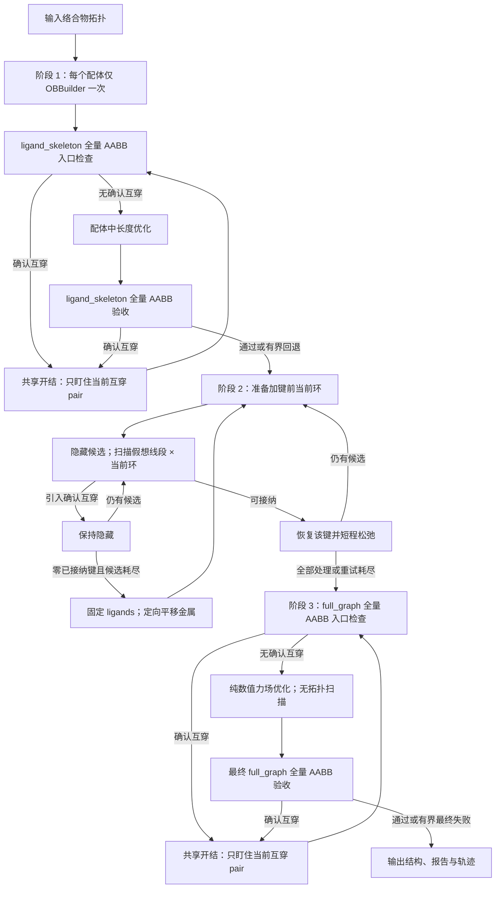

# 三阶段力场环键互穿与性能重构方案

日期：2026-09-24

状态：已实施并完成 187 分子标准验证

当前分支：`refactor/forcefield-three-stage`
规划基线：`b55ae69`
已验证生产代码：`f0a6e7c`

配套流程图制品：`plan/forcefield_three_stage_workflow.archify.json` 与
`plan/forcefield_three_stage_workflow.html`。

## 1. 核心决策

完整的金属络合物工作流严格分为：

1. 配体构筑阶段；
2. 配位键构筑阶段；
3. 络合物全局力场优化阶段。

规范要求如下：

- 阶段 1、3 仅在阶段入口或验收检查点执行一次全范围环键扫描。“全量扫描”指在严格 AABB broad phase 下覆盖所请求的全部 bond--ring 范围，并非为所有空间已分离 pair 生成稠密 finding。
- 每轮开结固定当前确认互穿的 pair。中间尝试仅复查该 watch set；watch set 清空或失效后才返回全量检查点。
- 阶段 2 不执行全分子环键扫描，只检查待构筑 metal--ligand bond 与当前已有环。
- Stage 2 不在入口无条件移动金属；仅当零配位键已接纳且全部候选路径确认受阻时，固定 ligands 并定向平移未锚定 metal center。
- 数值 optimizer 不考察环拓扑；早停只依据数值事实。完整结构验收属于阶段边界。
- 阶段 1、3 的拓扑检查点独立于 `quality_level`，在 `off/basic/standard/strict` 下都必须执行。
- 检查点生成的同一份 report 必须被验收、流程分支和开结初始化共同消费，不得在同一坐标上隐式补扫。
- Geometry 只报告数学事实；Forcefields 决定是否加键、修复、警告或拒绝验收。
- 仅 `PiercingState.PIERCES` 触发开环；`UNDETERMINED` 只报告，不自动修复。
- Forcefields 仅处理不大于 16 原子的 Relevant Cycles；更大环排除并警告。
- 有界修复失败时保留最佳闭合拓扑结构及轨迹并警告，不得丢弃全部坐标。

本方案不修改力场 backend/参数、Relevant Cycle 感知或三态几何结果的数学含义。

## 2. 目标工作流

### 2.1 完整三阶段流程



阶段 2 每次只接纳一根待构筑键，因此没有理由重新扫描所有已有键。阶段 1、3
的“入口检查”和“验收检查”均是明确 checkpoint；中间的数值优化不包含任何
全量或早退式环键拓扑扫描。

### 2.2 共享环键开结流程

```mermaid
flowchart TD
    A[接收阶段控制器已生成的检查点报告] --> B{存在确认互穿？}
    B -- 否 --> Z[返回阶段控制器]
    B -- 是 --> C[固定当前互穿 ring-bond pairs]
    C --> D[断开一根可处理环边]
    D --> E[微扰坐标]
    E --> F[短程力场优化]
    F --> G[恢复原先断开的准确环边]
    G --> H[只扫描固定互穿 pairs]
    H -- 至少一对仍互穿 --> D
    H -- 全部解除或 watch 失效 --> A
```



下一次 `D → H` 前检查尝试上限。预算耗尽时恢复最佳闭合拓扑帧，执行一次完整检查点扫描、记录警告，并遵循调用方回退策略。

## 3. 规划基线实施审计（`b55ae69`）

| 阶段 | 当前实施 | 正确部分 | 与目标的差距 |
|---|---|---|---|
| 配体构筑 | `ligand._build_ligand_proxies()` 依次执行一次 `_ob_build()`、预热、`_untangle_ring_piercings()`、精修和候选验收 | 开结 helper 已先全量扫描，再只监视已知 pair，watch 清空后返回完整检查点 | `level="basic"` 可能接纳未解决的候选；精修后只要互穿数没有增加，即使非零也可能保留 |
| 未锚定金属位置 | 配体 worker 跳过金属 component；金属继承输入坐标。全部候选拒绝后，首次执行零配位键整体系优化，后续执行全原子随机微扰与优化 | 不会由 ligand OBBuilder 任意重建金属 | 没有定向金属平移，也不保证产生任何无遮挡 metal--donor path |
| 配位键构筑 | `repair._restore_coordination_bonds_incrementally()` 每次检查一根候选键，末尾再做 `full_graph` 扫描 | 单候选范围及 AABB 已实现 | `ligand_skeleton` 无法检查已有 metal--organic chelate rings；末尾全局扫描违反新边界 |
| 全局优化 | `workflows._optimize_complex_working_mol()` 交替开结与优化，当前入口、逐 epoch fallback 和终检均使用 `ligand_skeleton` | 优化后结构不良时可重入修复 | 每个有效 epoch 完整验收并全范围扫描；optimizer 返回后立即再扫描一次；始终漏检含 metal--ligand edge 的螯合环 |

阶段 3 重复扫描路径为：

```text
_OpenBabelOptimizer.optimize() epoch loop
  -> _observe_frame()
     -> evaluate_structure_acceptance()
        -> _bond_ring_coordination_acceptance_section()
           -> geo.screen_bond_ring_relations()
```

`standard/strict` 走全范围稀疏 AABB；`basic/off` 下，`stop_on_ring_piercing=True` 仍触发独立的全范围早退扫描。因此改变 acceptance level 不能实现目标策略。

### 3.1 螯合环在配位键恢复与全络合物开结中的处理

#### 3.1.1 当前实现

Stage 2 当前按照以下顺序恢复配位键：

1. `_restore_coordination_bonds_incrementally()` 收集并隐藏全部原始 metal--ligand
   bonds（`repair.py:820--850`）。
2. `_restore_next_nonpiercing_coordination_bond()` 在检查候选前，先把该候选键真实
   恢复到分子图（`repair.py:725--739`）。
3. `_screen_coordination_bond_relations()` 随后以
   `ring_scope="ligand_skeleton"` 扫描该候选键（`repair.py:603--613`）。
4. 若扫描结果包含 `PIERCES`，再把候选键隐藏；否则保留该键并执行短程优化
   （`repair.py:734--781`、`repair.py:863--897`）。
5. 所有候选处理完毕后，再执行一次 `full_graph` 全局扫描并生成 Stage 2 的
   `final_*` 统计（`repair.py:921--956`）。

`ligand_skeleton` 在感知环前排除全部 metal--ligand edges。因此步骤 3 实际只会
检查候选配位键与有机配体环的关系，看不到：

- 由先前已恢复配位键形成的 metal--organic chelate rings；
- 当前候选键恢复后刚形成的 chelate ring。

`_is_coordination_cycle_closure()` 原本试图区分“候选键闭合自身螯合环”和“候选键
横穿环面”（`repair.py:581--590`），但候选路径的 `ligand_skeleton` scope 根本不会
产生包含金属的环 finding。该 helper 在真实候选筛查路径中没有执行其设计职责。

Stage 3 也存在同一范围缺口：开结入口、优化后检查、optimizer 的逐 epoch fallback
和 acceptance 扫描均使用 `ligand_skeleton`（`workflows.py:337--388`、
`optimizer.py:420--432`、`acceptance.py:804--818`）。因此其他键穿过已有螯合环时，
当前完整络合物流程仍可能漏检。

#### 3.1.2 目标实现

Stage 2 每轮使用加键前快照：

1. 当前图保留此前已经接纳的配位键，待处理候选键保持隐藏。
2. 从加键前 `full_graph` 提取 Relevant Cycles。该集合包含有机环和已经存在的
   chelate rings。
3. 不修改图拓扑，只以候选 metal 和 donor 的当前坐标构造有限假想线段。
4. 通过 AABB broad phase 扫描“候选线段 × 加键前当前环集合”。
5. 若存在 `PIERCES`，候选继续保持隐藏并检查下一根候选键。
6. 若不存在 `PIERCES`，才恢复原始候选键并执行短程松弛。
7. 坐标或拓扑改变后使本轮 workspace 失效；下一轮从新状态重新准备 workspace。
8. Stage 2 不执行全局终检；Stage 3 的 `full_graph` 入口 checkpoint 负责完整
   拓扑验收。

候选键保持隐藏时，由它新形成的 chelate ring 尚不存在于 Relevant Cycle 快照中，
所以“候选闭合自身螯合环”不会进入候选线段与环的笛卡尔积。已有 chelate rings
仍在快照中，候选键穿过它们时会被正常检出。该数据边界直接消除了自身闭环假阳性，
无需结果阶段的特殊过滤。

由此删除：

- `_is_coordination_cycle_closure()`；
- `_coordination_topology_relation_counts()`；
- Stage 2 末尾的 `_scan_full_graph_bond_ring_relations()` 调用。

Stage 3 的入口与最终 checkpoint 均改用 `full_graph`。Geometry 的 pair 枚举会排除
环自身边，因此 chelate ring 中的配位边不会与其所属环配对；其他键穿过该环时仍会
参与检查。Stage 3 开结时再由 Forcefields 按化学类型选边：有机环临时断开允许的
单共价环边；chelate ring 只临时断开 metal--ligand edge，并完整恢复原键元数据。

#### 3.1.3 前后差异

| 对比项 | 当前实现 | 目标实现 |
|---|---|---|
| 候选检查时的图拓扑 | 先真实恢复候选键 | 候选保持隐藏，仅构造假想线段 |
| 候选扫描的环集合 | `ligand_skeleton` | 加键前 `full_graph` Relevant Cycles |
| 有机环 | 可以检查 | 可以检查 |
| 已有 chelate ring | 被 scope 排除 | 纳入检查 |
| 候选新闭合 chelate ring | 被 scope 整体排除 | 尚未存在于快照，天然不参与 |
| 自身闭环假阳性处理 | 依赖实际路径基本不可达的特殊 helper | 由加键前快照的数据边界消除 |
| 拒绝候选 | 已改图后再回滚隐藏 | 分子图从未改变 |
| 接纳候选 | 已恢复键继续保留 | 筛查通过后才恢复原始键 |
| workspace 生命周期 | 每根候选通过正式分子接口重新扫描 | 同一坐标和拓扑下复用，变化后重建 |
| Stage 2 终检 | 末尾执行一次 `full_graph` 扫描 | 不执行；交给 Stage 3 入口 checkpoint |
| Stage 2 报告 | 声明最终 piercing/undetermined 状态 | 只记录配位键恢复过程事实 |
| Stage 3 环范围 | `ligand_skeleton` | `full_graph` |
| chelate ring 开边 | 未按环化学类型区分 | 只临时断开 metal--ligand edge |
| 环自身边 | 候选阶段尝试特殊过滤 | Geometry pair 枚举直接排除 |

### 3.2 未连接配位键前的金属坐标处理

#### 3.2.1 当前实现

当前没有专门的“金属平移到空旷位置”步骤：

1. 配体构筑前隐藏全部 metal--ligand bonds；worker 遍历 component 时跳过包含
   金属的 component（`ligand.py:88--100`）。OBBuilder、配体微扰和配体优化不会
   更新金属坐标。
2. worker 只回写非金属 component 的坐标，金属保留输入结构中的位置
   （`ligand.py:441--462`、`workflows.py:202--205`）。
3. `prepare_coordination_geometry()` 只是预留接口，当前直接抛出
   `NotImplementedError`（`coordination.py:91--102`）。
4. `Molecule.translation()` 虽然存在（`core.py:2555--2571`），但 forcefields
   当前没有调用它。
5. Stage 2 若某根候选通过，会先保留该配位键，再优化包含至少一根配位键的体系。
6. 若一轮全部候选均被拒绝，首次停滞轮会在零配位键状态执行整分子 Open Babel
   优化；第二次及后续停滞轮会先对全部原子施加独立高斯微扰，再优化
   （`repair.py:863--892`）。金属坐标可能因此变化，但这不是定向平移，也不保证
   金属处于空旷位置或任何 metal--donor 路径可连接。

因此，对问题“金属原子在未连接任何配位键前是否运行平移”的当前答案是：
**不运行专用平移；它最多随全原子随机微扰或无锚点 Open Babel 优化被动改变坐标。**

#### 3.2.2 目标实现

目标流程不在 Stage 2 入口无条件移动金属。先使用当前坐标检查全部 pending
metal--donor paths；仅当“当前尚未接纳任何配位键，并且本轮所有候选均因确认互穿
而不可连接”时，进入定向金属平移分支：

1. 固定全部 ligand 原子坐标，仅对尚未锚定的 metal center 施加整体平移向量。
2. 候选 metal 位置必须避免与 ligand 原子严重重叠。
3. 至少一条 metal--donor 有限线段必须满足可连接条件：不穿过 Relevant Cycle
   环面，不进入非 donor 原子的排斥球，不穿过非关联共价键的排斥胶囊，并保持
   元素尺度合理的初始配位距离。
4. 候选位置依次按可安全连接的 donor 数量、最小归一化 clearance、配位距离偏差
   排序；这里不调用力场能量评分。
5. 选定新位置后重建 frame workspace，再从候选键筛查开始。
6. 金属平移达到有界尝试次数仍无安全路径时，记录
   `metal-only placement infeasible`；随后按 Stage 2 的有界失败策略恢复剩余配位键、
   发出警告并交给 Stage 3，不进行无限随机移动。

该分支应封装在 `forcefields/coordination.py`，例如
`_relocate_unbound_metal_centers()`。Geometry 只提供 segment--cycle、
point--atom clearance 和 segment--bond clearance 等空间事实；触发条件、候选排序和
失败升级属于 Forcefields。

| 对比项 | 当前实现 | 目标实现 |
|---|---|---|
| Stage 2 入口 | 保留输入 metal 坐标 | 同样先保留输入坐标 |
| 首轮全部候选受阻 | 在零配位键体系上直接执行普通优化 | 先固定 ligands，定向平移 metal |
| 后续坐标变化 | 全原子独立随机微扰，包含 metal | metal-only 候选平移；接纳配位键后才进入有锚点松弛 |
| 平移触发条件 | 无专用条件 | 零 active bond 且全部候选均为 `PIERCES` |
| 位置判据 | 无 | 原子/键 clearance、环面可见性和元素尺度配位距离 |
| 失败终止 | 尝试耗尽后强制恢复剩余键 | 有界报告 `metal-only placement infeasible` 后进入既定强制恢复路径 |

## 4. 工作流重构

### 4.1 分离检查点与定向修复

将当前 `_untangle_ring_piercings()` 的混合职责拆成：

```text
_scan_ring_checkpoint()
    扫描完整请求范围；返回稀疏 AABB 报告

_repair_watched_ring_piercings()
    消费一个固定 watch batch
    执行 open -> perturb -> short optimize -> restore
    只复查 watched pairs；不主动全量扫描

_resolve_ring_piercings(checkpoint_report)
    消费调用者必填的 checkpoint report
    targeted batch -> full checkpoint
    负责重试上限、回退帧和警告
```

同一 checkpoint report 必须同时用于阶段验收、进入修复的决策和 watch set 构建，禁止同一坐标被 acceptance、workflow 和 repair 入口重复扫描。

内部 checkpoint 接口的 `bond_ring_report` 必须为非 `Optional` 必填参数。
公共的独立 `evaluate_structure_acceptance()` 可维持“自行扫描一次”的完整行为；
阶段控制器则调用消费现成 evidence 的专用接口，二者不得用 `None` 触发隐式兜底扫描。

建议的职责边界为：

```python
def evaluate_structure_acceptance_at_checkpoint(
    mol: Molecule,
    *,
    bond_ring_report: geo.BondRingScreeningReport[Ring, Bond],
    level: AcceptanceLevel,
    topology_reference: TopologyReference | None,
    forcefield_report: ForceFieldAcceptanceEvidence | None,
    forcefield_stage: ForceFieldStage,
    thresholds: StructureAcceptanceThresholds | None,
) -> ForceFieldValidationReport: ...

def evaluate_structure_acceptance(
    mol: Molecule,
    *,
    level: AcceptanceLevel = "standard",
    ...,
) -> ForceFieldValidationReport: ...  # 独立调用时内部恰好扫描一次
```

Python 3.9 实现使用 `Optional[...]` 表达相同签名语义；3.9 与 3.10+ facade
的参数名、默认值和行为必须一致。

### 4.2 阶段 1：配体构筑

每个非金属 component：

1. `OBBuilder` 仅调用一次；
2. 执行预热优化；
3. 执行一次 `ligand_skeleton` AABB 入口检查；
4. `PIERCES` 时进入定向开结；
5. watch 清空后返回全量检查点；
6. 执行候选/精修优化；
7. 最终仅执行一次配体检查点及基础数值/几何验收；
8. 精修若产生确认互穿，重新开结，不能因互穿数未增加而接纳。

正常接纳必须满足：

```text
basic 数值/几何门控通过
AND
confirmed bond-ring piercing count == 0
```

若无候选满足条件，则保留确认互穿数最低的闭合拓扑候选；相同计数时保留最后完成的帧，不引入额外综合评分。随后警告并允许进入阶段 2。

### 4.3 阶段 2：配位键构筑

每轮恢复：

1. 当前图包含已接纳配位键，隐藏待处理键；
2. 从加键前当前图的 Relevant Cycles 准备不可变 current-ring workspace；
3. 候选键仍保持隐藏，仅以两个端点形成假想线段；
4. 按确定顺序惰性扫描“该假想线段 × workspace 环”；
5. 引入确认横向互穿则拒绝并继续隐藏；
6. 否则恢复该键、短程松弛并结束本轮；
7. 松弛或微扰使坐标 workspace 失效；
8. 若当前尚无已接纳配位键且本轮全部候选都因 `PIERCES` 被拒绝，固定 ligands，
   定向平移未锚定金属并重建 workspace；
9. 若已有至少一根 active 配位键但剩余候选暂时均不可接纳，才执行受控微扰和
   短程松弛后开始新一轮；
10. 有界尝试耗尽后恢复全部剩余原始配位键并警告，不执行阶段 2 全局扫描。

| 环类别 | 阶段 2 策略 |
|---|---|
| 有机环 | 候选穿过时确认拒绝 |
| 已有 metal--organic chelate ring | 候选穿过时确认拒绝 |
| 仅由候选形成的螯合环 | 不在加键前快照中，不作为自身穿环 |
| 大于 16 元环 | 排除并报告 |
| `UNDETERMINED` | 警告，但不单独拒绝候选 |

`CoordinationBondRestorationReport` 只描述配位键恢复机械过程，字段固定为：

- `attempt_limit`；
- `attempts_completed`；
- `bond_count`；
- `metal_relocation_attempt_count`；
- `relocated_metal_indices`；
- `infeasible_metal_indices`；
- `forced_bond_keys`；
- `rejected_piercing_trial_count`；
- `undetermined_trial_count`；
- `excluded_ring_observation_count`；
- `warning_messages`。

删除 `final_piercing_count`、`final_undetermined_count`、`resolved` 等暗示
Stage 2 已完成全局拓扑验收的字段。是否无强制恢复可由
`forced_bond_keys` 推导，不再保存重复布尔量。

不保留误导性字段 alias；该新工作流没有已发布兼容负担。

### 4.4 阶段 3：络合物全局优化

```text
full_graph 入口检查点
  -> PIERCES：共享定向开结
  -> 无 PIERCES：纯数值 optimizer
  -> 一次最终 full_graph 验收
       -> PIERCES：共享定向开结，然后重复
       -> 其他：结束
```

完整图包括有机环与 metal--organic chelate rings。Geometry 已从候选 pair 中排除环自身边；Forcefields 仍须区分横向穿越与闭合自身螯合环的配位边。

开环策略必须按环类别显式分派：

- 纯有机环：沿用确定性的可恢复单共价环边选择；
- 含金属螯合环：只允许临时断开 metal--ligand edge，避免破坏配体共价骨架；
- 若螯合环没有可断开的配位边：保留闭合结构、标为 unresolved 并警告，禁止静默改断有机共价键；
- 恢复时使用原始 bond object/快照，精确恢复键级及元数据。

optimizer 应：

- 删除 `stop_on_ring_piercing`；
- 删除逐 epoch `evaluate_structure_acceptance()`；
- 删除逐 epoch 回退 `determine_bond_ring_piercing_state()`；
- 保留能量、梯度、位移、有限坐标、backend explosion 与 Open Babel 收敛信号；
- 仅由阶段控制器执行完整化学/拓扑验收。

optimizer 选择最低能量的数值可用帧，控制器仅验证一次。确认互穿时将该准确帧送修；其他终检失败仍保留该帧并警告。`epochs` 仍是常规优化总预算；预算耗尽后发现互穿仍可修复，并可执行一个已报告的稳定化 epoch。

这会把选帧语义从“每个 epoch 完整验收后选最低能量帧”改为“先在数值可用帧中选低能帧，再于阶段终点完整验收”。这是明确的业务行为变化，必须通过回归数据评估，不能描述为透明重构。

独立调用普通 `ff.optimize()` 时同样必须在返回前执行一次 terminal acceptance；
它不自动扩展为完整 complex repair workflow，但必须返回报告并在失败时保留最终结构、发出警告。

## 5. Geometry 性能设计

### 5.1 收益范围

优化惠及 segment--cycle、bond--ring、planar polygon、non-planar surface-family 及其未来调用者；不显著影响独立 point、line、plane 和普通 distance 函数。

### 5.2 行为等价的永久接缝

在 `geometry/relation.py` 引入：

```python
@dataclass(frozen=True)
class _CycleTopologyTemplate:
    triangulations: ...
    internal_edges: ...
    triangle_pairs: ...
    shared_simplices: ...

@dataclass(frozen=True)
class _PreparedCycleGeometry:
    cycle: Cycle
    coordinates: np.ndarray
    bounds: ...
    planarity: PlanarityMeasurement
    ...

def _cycle_topology_template(vertex_count: int) -> _CycleTopologyTemplate: ...

def _prepare_cycle_geometry(
    cycle: Cycle,
    settings: GeometrySettings,
) -> _PreparedCycleGeometry: ...

def _iter_prepared_segment_cycle_screenings(
    segments: Iterable[Segment],
    prepared_cycle: _PreparedCycleGeometry,
    settings: GeometrySettings,
) -> Iterator[SegmentCycleScreening]: ...
```

公开签名保持不变。接缝首次提交仍以标量执行，不缓存、不批处理，保证行为等价且可独立测试。

### 5.3 仅拓扑缓存

可缓存：环原子顺序/边索引、规范化 bond/ring keys、候选 pair 索引、按顶点数索引的三角剖分模板、内部对角线、triangle-pair/shared-simplex 索引。使用兼容 Python 3.9 的 `functools.lru_cache`，缓存值均为不可变 tuple。

禁止跨帧缓存：坐标/AABB、SVD 平面性/投影多边形、尺度/tolerance、三角形法向量/面积/退化状态、embedded-surface membership，以及任何 intersection state、feature、cause 或 evidence。`_PreparedNonplanarSurfaceFamily` 是坐标事实，微扰或优化后绝不可复用。

### 5.4 单帧数值准备

单个不可变坐标快照中：收集 `(N, 3)` 环坐标；仅准备一次 AABB/平面性；取得唯一三角形索引；构造 `(T, 3, 3)` 数组；一次计算向量、法向量、面积及内部边；用 `(B, 2, 3)` 表示候选线段；批量 AABB；按规范顺序精确判断 survivors。

八元非平面环的 132 种三角剖分最多引用三角形 792 次，但不同索引三角形最多 56 个。每个不同三角形只计算一次。首轮仍保留 tolerance-band、boundary-contact 与 coplanar cases 的标量分类器，只批处理稳定向量运算。

### 5.5 分子筛查计划

Forcefields 需要跨 package 复用 prepared workspace，因此以下对象不能是
`geometry` 的私有实现细节。在 `geometry/convert.py` 中加入窄而稳定的公开事实接口：

```text
BondRingScreeningPlan
  ring scope、size limit、ring atom keys、edge keys、candidate pair mapping

BondRingFrameWorkspace
  单个坐标快照及其 prepared cycle geometry

prepare_bond_ring_screening_plan(...)
prepare_bond_ring_frame(...)
screen_bond_ring_workspace(workspace, *, bond_keys=None, ring_keys=None,
                           stop_after_confirmed=False)
screen_segments_against_ring_workspace(segments, workspace, *,
                                       stop_after_confirmed=False)
```

现有 `screen_bond_ring_relations(mol, ...)` 保持为一次性便利接口，并在内部组合
上述 plan/frame/workspace 函数；Forcefields 的多次筛查路径直接使用 workspace
接口，避免隐藏的重复构建。

`frozen=True` 本身不能使 NumPy 数组不可变；构造时必须防御性复制并设置
`writeable=False`，或转为不可变 tuple。Geometry 负责创建和事实筛查，
Forcefields 负责生命周期。坐标变化使 frame workspace 失效；拓扑变化使
topology plan 失效；阶段 2 workspace 仅在接纳候选或坐标改变前有效；每次拓扑
修订后重建阶段 3 `full_graph` plan。geometry package 不得包含化学决策、验收
策略或修复命令。

环尺寸行为必须保持明确：`max_ring_size=16`；平面 9--16 元环仍走平面多边形
判定；非平面 9--16 元环受当前 `maximum_cycle_vertices=8` 约束，返回
`UNDETERMINED`/不完整证据而非错误地归为 `DOES_NOT_PIERCE`；大于 16 元环跳过并警告。

## 6. 可选数值稳定性早停

```python
@dataclass(frozen=True)
class OptimizationStoppingCriteria:
    window: int = 5
    maximum_energy_change_kj_mol: float = 1.0e-4
    maximum_atom_displacement_angstrom: float = 1.0e-4
    maximum_rms_gradient_kj_mol_angstrom: float = 1.0
    maximum_gradient_kj_mol_angstrom: float = 5.0
```

所有优化入口增加：

```python
stopping_criteria: Optional[OptimizationStoppingCriteria] = None
```

`None` 禁用并保持现状。完整窗口满足全部数值界限后只能“请求”结束；控制器仍必须执行终止全量验收。

- `converged/terminal_converged` 继续只表示 Open Babel 收敛；
- 新增 `termination_reason="stability_reached"`；
- `perturb_interval` 启用时，只能结束当前 segment，不得跳过构象探索；
- `increasing_vdw=True` 时禁用；
- 非有限坐标、能量、梯度或 explosion 优先。

停止条件是算法控制参数，不得复用科学验收标准 `StructureAcceptanceThresholds.strict_*`。

## 7. 数据与报告

### 7.1 Optimizer frame

将私有 frame 改为只含坐标、能量、RMS/最大梯度、explosion、backend convergence、近期能量变化与最大位移。`OptimizationFrameEvidence` 也只记录数值事实；逐 epoch 的 `accepted/failed_checks` 在检查点前未知，不得伪造。

### 7.2 最终验收证据

控制器保留 checkpoint 产生的完整 `BondRingScreeningReport` 并传入力场验收，验收不得隐藏第二次扫描。最终 `ForceFieldRunReport.quality_report` 保持完整；全仓消费者检查后删除不再计算且未使用的 `epoch_quality_reports`。

### 7.3 轨迹

- 按配置记录坐标与 topology revision；
- `save_movie` 只决定最终序列化，不控制流程；
- 检查点记录已计算的全扫描 evidence；
- optimizer 中间帧只记录 numerical evidence；
- repair frame 记录 watch 的 active piercing count，不额外全扫。
- Stage 2 记录金属平移前坐标、候选平移、接纳/拒绝原因和接纳后的坐标；这些事件只记录事实，不自行推进状态机。

## 8. 预计修改文件

| 文件 | 规划职责 |
|---|---|
| `forcefields/ligand.py` | 阶段 1 检查点及候选验收 |
| `forcefields/coordination.py` | 未锚定金属的条件平移、候选位置与可见性排序 |
| `forcefields/repair.py` | 检查点/定向修复拆分；阶段 2 current-ring 筛查 |
| `forcefields/optimizer.py` | 纯数值 epoch；可选早停 |
| `forcefields/acceptance.py` | 公共自扫描验收；阶段 checkpoint 消费必填预计算 ring evidence |
| `forcefields/workflows.py` | 三阶段状态机及阶段 3 循环 |
| `forcefields/contracts.py` | 报告与 stopping criteria |
| `forcefields/trajectory.py` | 分离 epoch 数值证据与 checkpoint 验收证据 |
| `geometry/relation.py` | prepared-cycle、拓扑模板与稳定批处理 |
| `geometry/convert.py` | 公开的扫描计划与不可变 frame workspace |
| `geometry/__init__.py` | 重导出窄的 prepared-screening 公共 API |
| `tests/test_cheminfo/geometry/*` | scalar/prepared/batch 差分测试 |
| `tests/test_cheminfo/test_complex_untangling_workflow.py` | 阶段边界、ring scope、重试测试 |
| `tests/test_cheminfo/test_forcefield_optimizer.py` | 纯数值 epoch 与早停测试 |
| `tests/test_cheminfo/test_forcefield_acceptance.py` | 预计算证据与单扫描测试 |

Python 3.9 与 3.10+ facade 的公开签名必须一致。新增 molecule、ring、bond、frame、report、workspace annotation 禁用 `Any`。

## 9. 提交与回滚计划

每项生产修改在同一 commit 中携带对应测试；profiling 数据和最终报告单独提交。

| 顺序 | 建议 commit | 范围 |
|---:|---|---|
| 0 | `docs(plan): define three-stage ring-piercing workflow` | 仅本文档 |
| 1 | `test(forcefields): characterize stage scan boundaries` | 表征与调用次数围栏 |
| 2 | `refactor(geometry): add scalar prepared-cycle seam` | 行为等价永久接缝 |
| 3 | `refactor(forcefields): separate numerical epochs from topology gates` | 移除逐 epoch 拓扑扫描 |
| 4 | `fix(forcefields): enforce ligand ring-piercing acceptance` | 阶段 1 验收与回退 |
| 5 | `fix(forcefields): screen coordination candidates against current rings` | 阶段 2 环范围与报告 |
| 6 | `feat(forcefields): relocate unbound metal when all paths are blocked` | 零 active bond 时的定向金属平移 |
| 7 | `fix(forcefields): validate and untangle the full complex graph` | 阶段 3 full-graph 与螯合环开边策略 |
| 8 | `refactor(forcefields): remove obsolete coordination topology helpers` | 删除 Stage 2 事后全扫及自身闭环特判 |
| 9 | `perf(geometry): cache immutable cycle topology templates` | 仅拓扑缓存 |
| 10 | `perf(geometry): precompute single-frame cycle kernels` | 单帧标量复用 |
| 11 | `perf(geometry): batch stable segment-cycle arithmetic` | 稳定运算向量化 |
| 12 | `perf(forcefields): reuse coordination screening workspace` | 阶段 2 每轮 workspace |
| 13 | `feat(forcefields): add opt-in stability stopping` | 默认 `None` 的独立特性 |
| 14 | `test(forcefields): validate 187-complex performance refactor` | 全量结果与 profile artifacts |

Commit 2 是行为中性的稳定接缝并作为永久基础；后续只依赖其抽象操作，不得
直接依赖 commits 9--11 的具体 cache/vector representation。每个性能 commit
完成后均须在临时 worktree 中实际执行一次单独 `git revert`，重跑对应 focused
tests，再丢弃该临时 worktree。只有“回撤后仍能构建并通过测试”才可声称可独立回滚。
业务流程修正与可选性能实现不得混在同一 commit。

## 10. 测试门禁

### 10.1 Geometry 等价性

为 3--8 元平面/非平面环、9 与 16 元平面/非平面环、17 元排除环、三态结果、端点/边界/共面/延长线接触、退化/guard-band、AABB 分离和不完整 surface family 建立 golden results。尤其验证 9--16 元非平面环返回 `UNDETERMINED` 而非假阴性。scalar、prepared、batch 路径的 state、feature/cause、surface evidence、逻辑测试次数、finding 顺序/source key 必须一致，intersection point 在声明容差内一致；刚体变换和受支持的等比例缩放不得改变三态结果。

### 10.2 阶段流程

- 阶段 1：入口全扫一次；watch 未清空时不全扫；清空后再全扫；确认互穿不得正常接纳。
- 阶段 2：全分子扫描为零；只扫候选键；首个可接纳候选后停止；可见已有有机环/螯合环；忽略候选自身新闭环但不忽略其他 crossing bond；workspace 每个未变坐标帧只建一次，松弛/微扰后重建。
- 金属平移：存在安全候选时调用次数为零；零 active bond 且全部候选为 `PIERCES` 时进入平移分支；候选次数受上限约束；平移期间 ligand 坐标逐元素不变；平移后 workspace 必须重建；有界无解时返回 `metal-only placement infeasible` 警告并保留完整轨迹。
- 阶段 3：普通 epoch 内环扫描为零；每轮只在入口和终止各全扫一次；终检失败复用同一报告进入 repair，不立即重复扫描。
- `UNDETERMINED` 与大于 16 元环仅警告，不进入 repair。
- `quality_level=off/basic/standard/strict` 参数化测试中，阶段 1、3 的 checkpoint 数量完全一致；阶段 1 始终为 `ligand_skeleton`，阶段 3 始终为 `full_graph`。
- 独立 `ff.optimize()` 每次运行只在终点执行一次验收；其数值 epoch 内拓扑扫描数为零。

### 10.3 Optimizer 与早停

`stopping_criteria=None` 时，Open Babel 调用、epoch、能量、轨迹和 termination reason 保持一致。显式启用时验证：窗口完整性、全部阈值、非有限值/explosion 优先、终止全验收、终止互穿重入修复、`increasing_vdw=True` 禁用、不跳过微扰及 backend convergence 真实性。

### 10.4 187 分子完整校验

按固定种子、16 进程运行，保留全部报告、完整轨迹、优化 MOL2/SDF、final PNG 和 integrity reports。

| 指标 | 当前基线 |
|---|---:|
| 输入 | 187 |
| 进入 forcefields | 178 |
| CBond 失败 | 9 |
| 最终质量通过/失败 | 171 / 7 |
| Wall time | 380.59 s |
| Aggregate FF time | 5630.93 s |
| Median / P95 | 20.70 / 81.50 s |

透明 geometry/cache commits 必须保持状态、pair states 和报告完全一致，坐标与能量在既定序列化容差内一致。调度与可选早停可能改变坐标，必须报告新增最终互穿、pass-to-fail 转变、状态转换、能量/坐标 RMSD、wall/aggregate/median/P95/max，以及：Stage 1/3 full-checkpoint 次数、watch-pair 复查次数、Stage 2 candidate-pair 次数、AABB 淘汰率、exact-kernel 次数、OBBuilder 调用次数、金属平移触发次数/耗时/成功恢复键数。每项优化只与直接父 commit 独立 profile，不得把顺序收益当成独立因子相乘。

以下四项必须做独立 ablation/profile：

1. 全量扫描采用严格 AABB broad phase；
2. 开结中间 epoch 以 frozen watch set 替代全量扫描；
3. 配位恢复仅扫描候选假想线段并复用本轮 workspace；
4. 每个配体仅调用一次 OBBuilder。

可选稳定窗口早停作为第五项独立实验，不并入上述四项收益，也不默认开启。

## 11. 验收标准

1. 三阶段及扫描边界在 workflow 代码中直接可见；
2. 阶段 1、3 无隐藏的逐 epoch 全范围扫描；
3. 阶段 2 无全局扫描，且正确区分已有环与候选新闭合螯合环；
4. watch 清空、失效或尝试终止前不全扫；
5. 同一 checkpoint report 复用于验收、流程控制和 watch 初始化；
6. geometry cache 无过期坐标数据；
7. 各性能 commit 可独立回滚；
8. Python 3.9 与 3.10+ facade 签名一致；
9. focused tests 与 187 分子验证通过；
10. 最终报告同时记录速度、化学质量及回归。

## 12. 明确排除范围

- 修改 Relevant Cycle 感知；
- 修改平面/非平面互穿数学定义；
- 将 `UNDETERMINED` 视为化学不合理；
- 修复大于 16 元环；
- 修改目标配位键集合、键类型或力场参数；
- 添加静默 fallback；
- 坐标变化后复用坐标相关 geometry；
- 在完整验证证据审查前改变可选稳定性早停的默认行为。

## 13. 实施与验收结果

生产重构已在 `refactor/forcefield-three-stage` 分支完成。最终生产代码
commit 为 `f0a6e7c`，包含三阶段边界、固定 watch 修复、AABB/workspace
复用、全局零配位键金属平移条件、轨迹 checkpoint evidence，以及修复后
坐标与数值报告的一致性约束。

最终相关回归测试为 **634 passed**。标准 187 分子、16 进程验证结果为：

| 指标 | 基线 | 重构后 |
|---|---:|---:|
| 质量通过 / 失败 | 171 / 7 | 171 / 7 |
| CBond 失败 | 9 | 9 |
| Wall time | 380.590 s | 157.776 s |
| Aggregate case time | 5669.518 s | 2365.233 s |
| Median / P95 | 20.699 / 81.496 s | 11.672 / 23.587 s |
| 最长单例 | 207.612 s | 71.749 s |

全部 187 个状态与基线一致。178 个进入力场的样本全部生成并通过读取校验的
完整轨迹、MOL2、SDF 与 final PNG；无内部异常或产物缺失。AABB 在
406103 个 checkpoint 候选 pair 中排除了 363777 个（89.58%），42326 个
进入精确几何核。31 个样本曾出现确认互穿的中间 checkpoint，最终确认互穿数
均为 0。

完整实施说明、失败样本分析、长尾分析、坐标对比及四项独立性能证据见
`plan/improve_ff_efficient.md`；机器可读结果见
`movie/extractants_eu_three_stage_refactor_16c_20260924/`。
